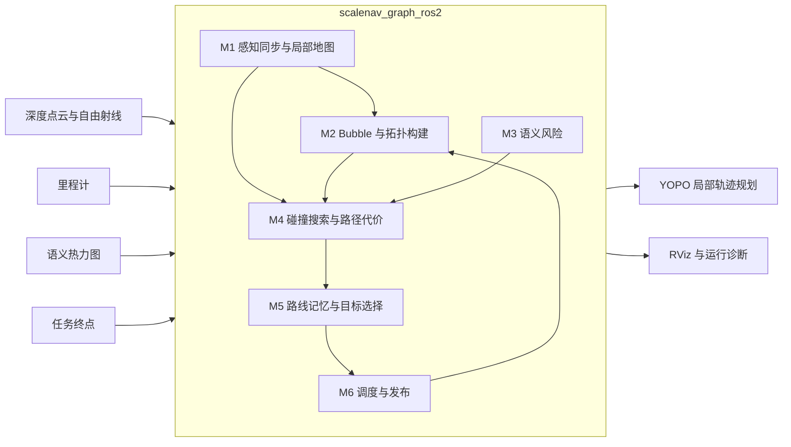
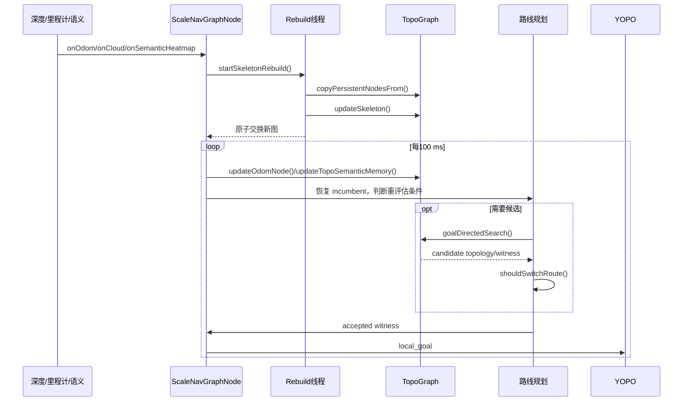
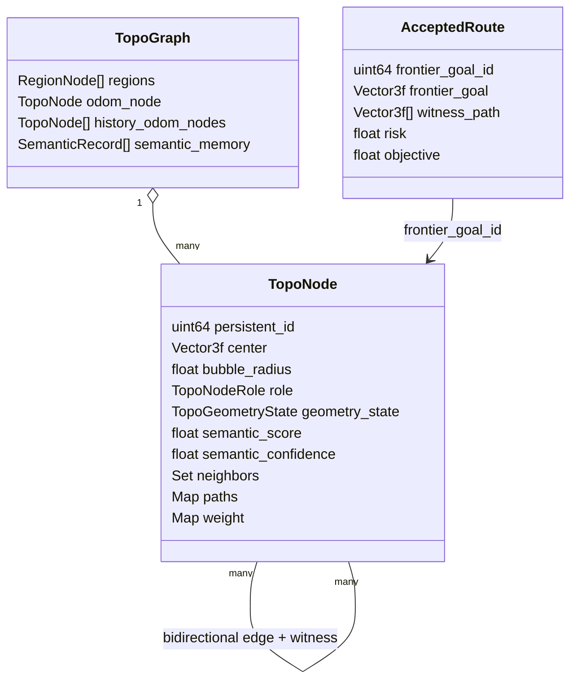
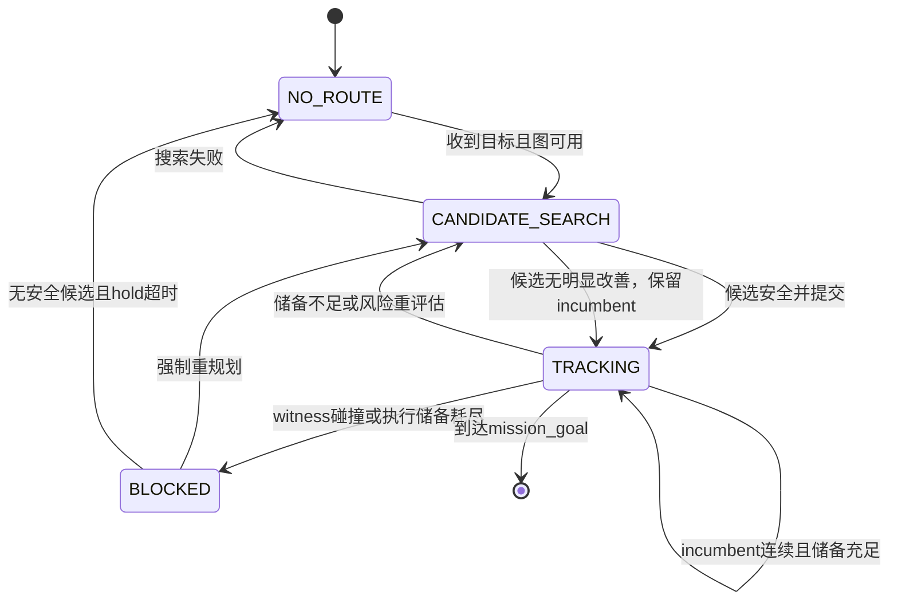
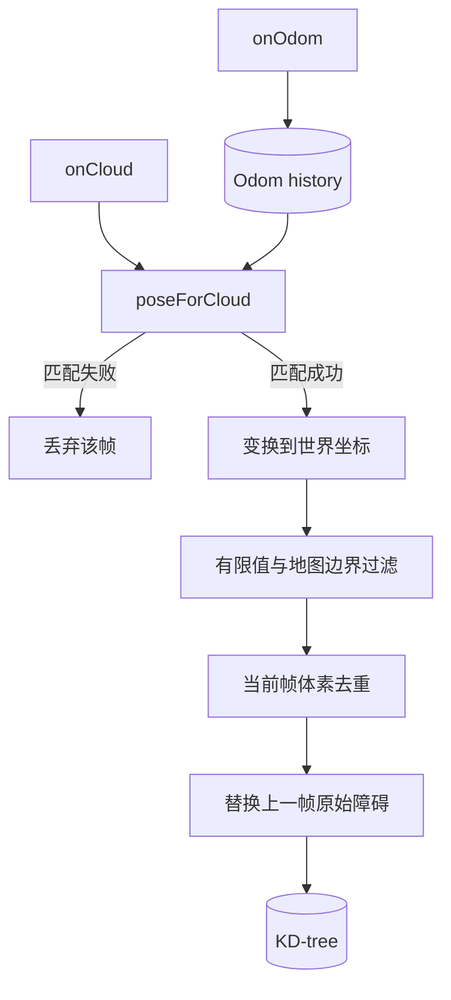
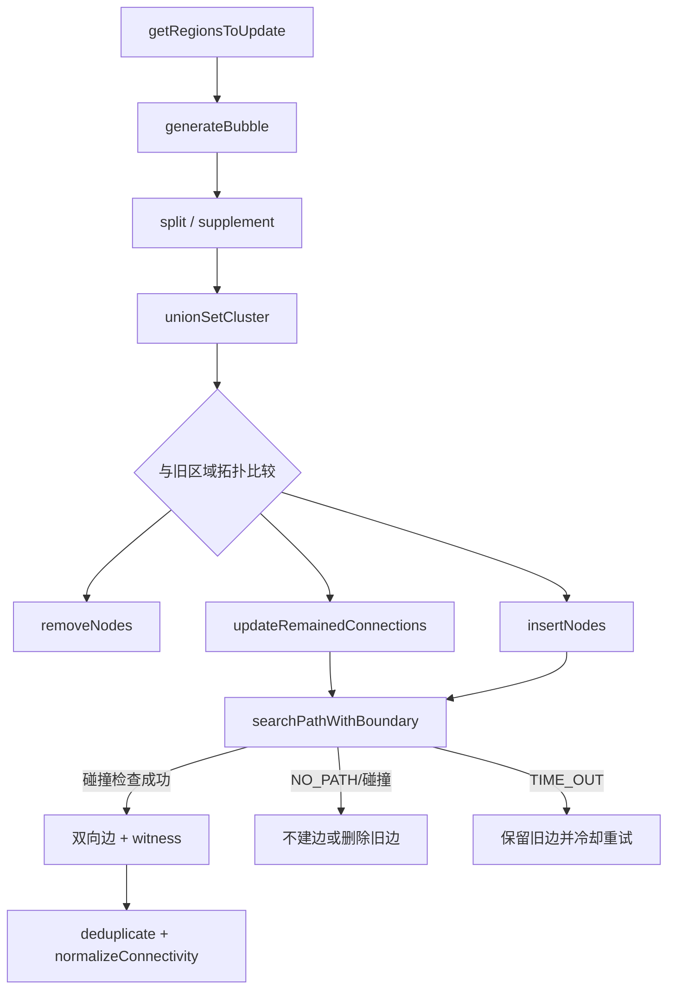
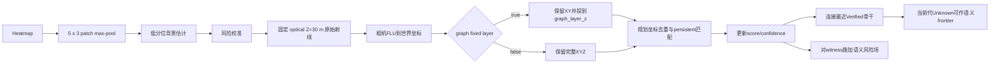
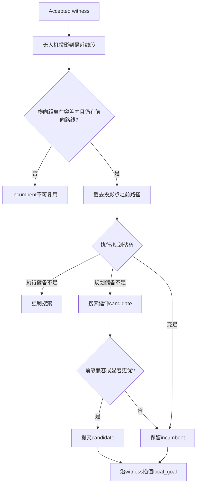

# ScaleNav / EPIC 在线规划算法详细设计说明书

| 项目 | 内容 |
|---|---|
| 文档标识 | `SCALENAV-EPIC-ADD` |
| 文档版本 | `V1.1` |
| 适用软件 | `scalenav_graph_ros2` |
| 设计层级 | 系统设计、模块详细设计、函数设计 |
| 测试规格 | [FUNCTION_TEST_CASES.md](FUNCTION_TEST_CASES.md) |
| 训练与在线集成 | [YOPO_TRAINING_INTEGRATION_DESIGN.md](YOPO_TRAINING_INTEGRATION_DESIGN.md) |
| 实测记录 | [TEST_REPORT_2026-08-26.md](test_reports/TEST_REPORT_2026-08-26.md) |

## 1. 文档说明

### 1.1 编制目的

本文规定 EPIC 在线规划链路的软件结构、数据接口、运行时序、状态转换、模块处理逻辑及函数接口，作为编码、代码评审、单元测试、模块测试和集成测试的共同依据。

### 1.2 适用范围

| 设计对象 | 实现位置 |
|---|---|
| ROS2 在线调度 | `src/global_graph/scalenav_graph_ros2/src/scale_manager/src/scalenav_graph_node.cpp` |
| 局部占据地图 | `src/global_graph/scalenav_graph_ros2/src/lidar_map/` |
| Bubble、TopoGraph 与 A* | `src/global_graph/scalenav_graph_ros2/src/pointcloud_topo/` |
| 路线记忆判定 | `src/global_graph/scalenav_graph_ros2/include/scalenav_graph_ros2/route_memory.hpp` |

ROS2 兼容封装、RViz 绘制辅助函数、日志格式化函数及第三方 LKH/TSP 求解器不纳入函数级详细设计。上述部分通过编译检查或上层接口集成测试进行验证。

### 1.3 术语

| 术语 | 定义 |
|---|---|
| 安全空间 | 点或 witness 到最近障碍物的可用距离；英文接口和参数仍使用 `clearance` |
| Bubble | 以自由空间点为中心、以安全空间为半径的局部安全球 |
| TopoGraph | 由拓扑节点、双向边和边 witness 构成的持久化图 |
| witness | 通过点云碰撞检查的边内实际折线路径 |
| incumbent | 当前已经提交、允许继续执行的路线 |
| candidate | 本规划周期新搜索到、尚未提交的候选路线 |
| persistent id | graph rebuild 前后用于恢复同一拓扑节点的稳定标识 |
| optical Z | 相机光轴方向深度；不等同于归一化射线的欧氏距离 |

## 2. 系统详细设计

### 2.1 系统边界

EPIC 位于深度/语义感知与 YOPO 局部轨迹规划之间。输入为深度几何、语义风险、无人机状态和任务终点；输出为已验证路线、短前视控制目标和诊断数据。动力学轨迹生成、飞控执行及图像语义网络推理不在本软件内完成。

Route-Conditioned YOPO 的离线数据制作、训练、模型评测和在线原子接口见
[YOPO_TRAINING_INTEGRATION_DESIGN.md](YOPO_TRAINING_INTEGRATION_DESIGN.md)。生产路线仍只由
EPIC accepted witness 定义；训练侧真值搜索仅生成合成标签，YOPO 只在已提交路线的局部
安全走廊内选择动力学轨迹，不重新决定全局绕行方向。



### 2.2 外部接口

| 类型 | 接口 | 主要内容 | 默认频率 |
|---|---|---|---:|
| 输入 | `/depth/points` | 深度相机占据点云 | 约 10 Hz |
| 输入 | `/depth/free_rays` | 深度相机自由射线端点 | 约 10 Hz |
| 输入 | `/sim/odom` | 位置、姿态、速度、时间戳 | 仿真发布频率 |
| 输入 | `/goal` | `world_enu` 中的 `mission_goal` | 事件触发 |
| 输入 | `/scalenav/text_heatmap_raw` | 图像语义风险热力图 | 约 2 Hz |
| 输出 | `/scalenav/path` | accepted witness path | 规划成功时，默认 10 Hz |
| 输出 | `/scalenav/local_goal` | YOPO 当前执行点 | 规划成功时，默认 10 Hz |
| 输出 | `/scalenav/graph`、`/scalenav/bubbles` | 拓扑与自由空间可视化 | 规划/重建周期 |
| 输出 | `/scalenav/clearance` | 无人机及路线安全空间 | 规划周期 |

表内频率为缺省配置，实际值由 `scalenav_graph.launch.py` 参数确定。

### 2.3 软件结构

```mermaid
flowchart TD
    CB1[onOdom / onCloud] --> Map[(Current-frame occupied view)]
    CB2[onSemanticHeatmap] --> SemanticFrame[(SemanticFrame)]
    Goal[onGoal] --> State[(Mission and route state)]

    Map --> Rebuild[startSkeletonRebuild]
    Rebuild --> Bubble[Bubble generation]
    Bubble --> Diff[Topology diff]
    Diff --> Graph[(Persistent TopoGraph)]
    SemanticFrame --> Semantic[updateTopoSemanticMemory]
    Semantic --> Graph

    Timer[100 ms update timer] --> Planner[update]
    Graph --> Planner
    State --> Planner
    Planner --> Search[graphSearch / goalDirectedSearch]
    Search --> Compare[Incumbent-candidate evaluation]
    Compare --> Route[(Accepted witness)]
    Route --> Local[selectNextGoal]
    Local --> Output[/path, /local_goal, /clearance]
```

### 2.4 规划周期时序



### 2.5 目标分层

| 目标 | 生命周期 | 含义 |
|---|---|---|
| `mission_goal` | 任务级，收到新 `/goal` 时更新 | 最终任务终点 |
| `frontier_goal` | 路线级，前向储备不足或路线失效时更新 | 局部图远端的路线承诺 |
| `local_goal` | 控制级，每个成功规划 tick 更新 | accepted witness 上的短前视执行点 |

局部图半径缺省为 `45 m`。frontier 按 accepted witness 已执行比例刷新，缺省比例为
`0.40`；`3.5 m` 的旧 frontier margin 参数仅保留兼容。`local_goal` 从 accepted witness
上按 `15 m` 前视距离插值产生。


### 2.6 数据结构



| 数据项 | 保存范围 | 更新位置 | 一致性要求 |
|---|---|---|---|
| 障碍点云 | M1 当前深度帧的几何观测，非拓扑持久化 | `updateCloudMapOdometry()` | 生产默认每帧替换；体素去重；不复制为 persistent TopoNode；正值历史半径仅作兼容模式 |
| TopoNode/edge | M2 跨 rebuild 持久图 | `updateSkeleton()` | persistent id 稳定；边双向；边带 witness |
| 语义属性 | TopoNode 及语义记忆 | `updateTopoSemanticMemory()` | 分数 `[0,1]`；重复观测合并 |
| accepted witness | 规划器状态 | `update()` | 仅在候选提交时替换 |
| local goal | 控制输出状态 | `selectNextGoal()` | 位于无人机前方 accepted witness 上 |

普通几何节点和固定深度语义节点均使用 `TopoNodeRole::Geometric`。真实 Bubble 验证前，语义节点的 `geometry_state` 为 `Unknown`；验证后为 `Verified`。`TopoNodeRole::Odom` 用于规划起点，不参与持久节点复制。

### 2.7 路线状态机



### 2.8 并发控制

| 共享对象 | 写入方 | 读取方 | 保护方式 |
|---|---|---|---|
| odom 历史 | state callback | cloud/semantic callback | `odom_mutex_` |
| 当前图指针 | rebuild worker | planner/publisher | `graph_mutex_` |
| 图结构 | rebuild/planner | planner/publisher | `topology_operation_mutex_` |
| 最新语义帧 | semantic callback | planner | `semantic_mutex_` |
| 节点外语义记忆 | planner/rebuild | planner/rebuild | `semantic_memory_mutex_` |

后台 rebuild 同一时刻只能存在一个 worker。新图先复制 persistent 数据并完成 topology diff，再交换到在线指针；不得向规划线程暴露半构建图。

### 2.9 异常处理

| 故障 | 处理 |
|---|---|
| 当前 witness 碰撞 | 硬失效；禁止继续发布对应 local goal，允许强制切换到安全候选 |
| frontier_goal 暂时无法重映射 | 若 accepted witness 连续、无碰撞且执行储备足够，则继续执行旧路线 |
| A* 超时或无路 | 保留安全 incumbent；不得用空候选覆盖路线记忆 |
| 语义帧过期或姿态无法对齐 | 丢弃该语义帧，不改变当前路线 |
| 候选仅有轻微收益 | 由风险/代价滞回拒绝，保留 incumbent |
| local goal 短时计算失败 | 在 hold timeout 内复用仍在前方且未阻塞的上一目标 |

## 3. 子模块设计

### 3.1 M1 感知同步与局部障碍地图

| 项目 | 设计内容 |
|---|---|
| 输入 | `/sim/odom`、`/depth/points`、`/depth/free_rays` |
| 处理 | 时间对齐、坐标变换、非法点过滤、当前帧体素去重、KD-tree 替换 |
| 输出 | 局部占据点集、最近障碍距离、KNN 结果、AABB 查询结果 |
| 状态性质 | 生产默认为当前帧几何视图；路线记忆由 TopoGraph/Bubble/edge witness 持久化，进程退出后不恢复 |
| 异常处理 | 无匹配姿态或点坐标非有限时丢弃输入；空地图查询返回安全的空结果 |



同一体素保留距离体素中心最近的点。`map_history_radius_m=0` 时，每次成功深度回调都用新帧替换障碍点集和 KD-tree，上一帧 hit 不再参与 clearance、Bubble 或边碰撞计算。只有显式配置正值时才启用旧的有界滑窗兼容模式。需要跨帧保留的路线信息由 M2 的 TopoGraph、Bubble 和 accepted witness 保存，M1 不把原始占据点持久化为 TopoNode。

### 3.2 M2 Bubble 与拓扑图构建

| 项目 | 设计内容 |
|---|---|
| 输入 | 局部占据地图、自由区域、旧 TopoGraph、update goal |
| 处理 | 区域选择、Bubble 生成、并查集聚类、拓扑差分、边重验、持久数据恢复 |
| 输出 | 双向 TopoGraph、边 witness、Bubble 快照、更新耗时统计 |
| 持久化状态 | 跨 detached rebuild 保留 persistent node、edge、witness 和 semantic memory；进程重启后的磁盘恢复不在本系统范围内 |
| 异常处理 | 边搜索超时采用软重试；碰撞 witness 删除；无路径的新节点允许保留但不得形成可执行边 |



Bubble 中心必须位于自由空间，半径不得超过最近障碍安全空间。相交 Bubble 通过并查集形成连通分量，每个连通分量生成一个拓扑节点。几何重复合并容差缺省为 `0.05 m`；该容差不得扩大到地图体素尺寸，以免合并有效分支。

M1 的当前帧点云快照是 M2 的局部观测输入，不等同于 M2 的持久图。M2 通过 persistent id、边和 witness 在 graph rebuild 间保留拓扑结构；Bubble 差分只由当前深度实际触发的 region 更新，不沿 mission goal 预先种入未观测 region。

### 3.3 M3 远场语义风险

| 项目 | 设计内容 |
|---|---|
| 输入 | 语义热力图、相机 FOV/外参、对应时刻无人机姿态 |
| 处理 | patch max-pool、背景基线校准、固定 optical Z 投影、世界坐标变换、近点合并、EMA 更新 |
| 输出 | 当前代临时语义 frontier、带语义属性的 TopoNode、局部风险查询、语义重评估请求 |
| 持久状态 | 节点语义分数、置信度、观测次数、时间戳、节点外恢复记录 |
| 异常处理 | 不支持的图像编码、非有限分数、过期帧或无匹配姿态时不更新图；临时语义边的最终 witness 失败时立即断开 |



语义点不读取 patch 对应的 measured depth。固定 `30 m` 表示相机 optical Z，不是归一化射线距离，因此边缘 patch 的三维距离可以大于 `30 m`。新语义点初始为 `Unknown`，真实 Bubble 到达同一位置时提升为 `Verified` 并保留语义属性。

空间匹配在写入图之前执行规划层投影。`graph_fixed_layer=true` 时，raw 三行射线仍用于
patch 分数、FOV 位置和行一致性置信度计算，但写入 TopoGraph 的中心统一为
`(world_x, world_y, graph_layer_z)`；同一列投影后落入 `semantic_point_separation_m` 的候选
按分数排序去重。`graph_fixed_layer=false` 时才保留完整三维节点位置。detached rebuild
复制 persistent 节点和边 witness 时再次执行同一投影，防止旧三维节点混入平面图。

新建或本帧重新命中的 `Unknown` 语义节点最多检查 4 个最近骨干锚点，并最多连接 2 个
`Verified` 节点；只有尚无实测骨干时才使用 odom 作为启动后备。语义节点之间禁止连接，
当前代语义节点只能作为搜索终点，不能作为两个实测走廊之间的中转点。该连接是固定深度
假设形成的临时直线，最终 candidate witness 仍由当前障碍图验证；验证失败时立即双向删除
对应语义边。真实 Bubble 到达同一位置后把语义属性提升到 `Verified` 几何节点。

PEARL 校准分数门槛默认为 `0.20`。fixed-layer 模式已经消除了节点高度语义，因此不再按
原始射线低于飞行层的高度重复降低 ground confidence；非 fixed-layer 模式仍保留该衰减。
风险锚点要求分数和置信度越过门槛，分数使用 EMA 更新。历史 `Unknown` 节点可以保存在
persistent memory 中，但只有当前语义时间戳的 `Unknown` 节点进入 frontier/风险工作集；
历史 `Verified` 语义节点继续作为长期风险证据。

### 3.4 M4 碰撞搜索与统一路径代价

| 项目 | 设计内容 |
|---|---|
| 输入 | TopoGraph、起终点、局部点云、搜索半径、超时及代价权重 |
| 处理 | 栅格安全判定、Bubble A*、折线短化、拓扑 A*、当前代语义 frontier 优先和实测 frontier 后备 |
| 输出 | 搜索状态码、碰撞安全 witness、节点路径、统一路径代价 |
| 异常处理 | 起点/终点不安全分别返回 `START_FAIL`/`END_FAIL`；预算耗尽返回 `TIME_OUT`；无连通路返回 `NO_PATH` |

对边 `e=(u,v)`，代价定义为：

```text
L_e = weight(u,v)，无显式权重时取 ||v-u||
G_e = w_path * L_e * d_prev
S_e = w_semantic * L_e * [-log(max(0.001, 1-R_e))]
D_e = w_clearance * ||v-u|| * (d_target/(d_target+d_min))^2，d_min>=0
C_e = G_e + S_e + D_e
```

`d_prev` 仅在该边属于上一条 accepted route 时取 `[0,1]` 内的连续性因子，否则为 `1`。`R_e` 使用边 witness 折线计算，不使用节点中心弦线。`d_target` 是安全距离衰减尺度，不是零代价阈值；因此安全空间越大的可行边仍具有更小的安全代价。`graphSearch()` 搜索指定 frontier_goal；`goalDirectedSearch()` 在 `35 m` 局部窗口内联合评价前向进度与总代价。

对候选 frontier_goal `q`，额外计算 frontier loss：

```text
L_frontier(q) =
    w_reserve * reserve_shortfall(q)
  + w_direction * mission_direction_error(q)
  + w_fov * fov_position_penalty(q)
  + w_smooth * candidate_continuity_penalty(q)
  + w_semantic * semanticRisk(q)
  + w_clearance * clearancePenalty(q)
  + w_geometry * pathGeometryCost(q)
```

当前 `goalDirectedSearch()` 的生效排序分为两层：进入任务终点窗口时优先搜索任务终点；
普通滚动搜索中，若存在可达的当前代语义 frontier，则按 `g + w_path * goal_distance`
选择语义终点，否则在实测 frontier 中优先选择到 mission goal 距离最小者，并以路线长度
打破平局。边展开的 `g` 已包含几何、语义、安全空间和上一 accepted route 连续性代价。

函数签名仍保留进度、任务方向、FOV、平滑度及 `31.5 m` 参考距离的兼容参数，但当前实现
未把这些参数加入 terminal 总 loss。因而“所有物理可行 terminal 采用完整统一 loss 排序”
仍是待实现验收项，不能作为现行代码能力。物理不可行 candidate 仍必须由断连、缺失
witness、碰撞、安全空间不足或无法形成 local goal 拒绝；语义临时边允许进入 A*，但只有
最终 live witness 复核通过后才能提交。

### 3.5 M5 路线记忆、frontier 与 local goal

| 项目 | 设计内容 |
|---|---|
| 输入 | incumbent/candidate topology path、各边 witness、无人机位置、mission goal、风险与代价 |
| 处理 | witness 拼接、无人机投影、前向裁剪、frontier_goal 恢复、候选滞回比较、frontier 延伸、local goal 插值 |
| 输出 | accepted witness、frontier goal、local goal、路线模式及切换原因 |
| 持久状态 | frontier_goal persistent id、accepted witness、已评估风险、上一 local goal 及发布时间 |
| 异常处理 | incumbent 碰撞时硬失效；单次 remap/A* 失败时继续验证并保留可执行 witness；hold 超时后停止复用 local goal |



拓扑节点路径用于图搜索与 frontier_goal 标识，控制输出必须来自边 witness 拼接结果。
candidate 生成后仍与 incumbent 做代价、风险、前缀兼容性和滞回比较；当前路线硬失效时允许
强制切换，其他情况只有满足现有切换门槛才提交。

terminal 搜索本身尚未实现完整的候选 loss 表。现行代码优先采用当前代可达语义 frontier，
并按含边代价的 `g+h` 选择；没有可达语义 frontier 时，Verified frontier 使用到 mission
goal 的距离排序。任务方向、FOV、前向储备和路线平滑度参数仍位于函数签名中，但没有参与
terminal 排序。因此重复风险场密度、软偏好权重切换和长期任务进度仍需由测试规格中的
`TC-M4-017/019/020`、`MT-M4-004/005` 和闭环用例继续约束，当前代码不能据此标为通过。

### 3.6 M6 在线调度、发布与诊断

| 项目 | 设计内容 |
|---|---|
| 输入 | M1-M5 状态、100 ms timer、rebuild 周期 |
| 处理 | 图快照获取、语义应用、odom 连接、路线恢复/搜索/提交、ROS 消息组装 |
| 输出 | `/scalenav/path`、`/scalenav/local_goal`、图/气泡 marker、安全空间和运行统计 |
| 调度 | `update()` 缺省 10 Hz；rebuild 独立后台线程且禁止重入 |
| 发布条件 | 路线已提交、witness 连续、当前碰撞检查通过、local goal 有限且在规定图层 |

`update()` 的固定调用顺序为：取得图快照、应用最新语义帧、更新 odom 节点、恢复 incumbent、计算路线风险与储备、按需搜索 candidate、执行切换判定、更新 accepted witness、选择 local goal、发布结果。`writeGraphSnapshot()` 与飞行统计只读取本周期快照，不参与路线判定。

## 4. 函数设计

以下函数是测试基线。重载函数按同一逻辑接口列出，但测试必须覆盖每种参数类型。`调用频率` 是运行时频率，不是测试重复次数。

### 4.1 M1 感知与地图函数

| 函数 | 输入 | 输出/副作用 | 设计要点 | 调用频率 |
|---|---|---|---|---|
| `LIOInterface::init` | ROS node handle | 参数、订阅、KD-tree 就绪 | 参数缺省值可用，空地图查询安全 | 启动 1 次 |
| `LIOInterface::IsInBox`（2 重载） | `Vector3f` 或 `PointType` | 是否在任务盒且不在禁区 | 边界闭区间，禁区优先 | 按点查询 |
| `LIOInterface::IsInMap`（2 重载） | `Vector3f` 或 `PointType` | 是否在全局地图内 | 边界留 `1e-4` 安全裕量 | 按点查询 |
| `LIOInterface::getDisToOcc`（3 重载） | 点坐标 | 最近占据距离 | 空地图和类型转换结果一致 | A*/安全空间热点 |
| `LIOInterface::KNN` | 查询点、`k` | 邻点及平方距离 | 结果数量不超过 `k` | Bubble 生成 |
| `LIOInterface::boxSearch` | AABB 上下界 | 盒内点集 | 不返回盒外点 | 区域更新 |
| `LIOInterface::updateCloudMapOdometry` | 点云、odom | 更新非持久化障碍点云/KD-tree | 默认当前帧替换与体素去重；正半径启用滑窗兼容模式 | 深度帧，约 10 Hz |
| `ScaleNavGraphNode::onOdom` | odom 消息 | 当前状态及姿态历史 | 四元数归一化，历史有界 | odom 频率 |
| `ScaleNavGraphNode::poseForCloud` | 时间戳、容差 | 匹配姿态与成功标志 | 超出容差返回 false | 每点云/语义帧 |
| `ScaleNavGraphNode::onCloud` | 世界/机体系点云 | 更新 LIO 地图并触发重建条件 | 使用匹配姿态，过滤非法点 | 约 10 Hz |
| `ScaleNavGraphNode::onFreeRays` | 自由射线消息 | 当前实现无地图占据副作用 | 不得把自由射线端点写入 M1 跨帧占据缓存或 M2 持久图 | 约 10 Hz |

### 4.2 M2 Bubble 与拓扑函数

| 函数 | 输入 | 输出/副作用 | 设计要点 | 调用频率 |
|---|---|---|---|---|
| `projectGraphPoint` | 点、planar 标志、层高 | 投影点 | planar 时仅替换 z | 每观测点 |
| `TopoGraph::init` | ROS handle、地图、Bubble A* | 初始化图参数与区域 | 依赖非空且参数一致 | 每次建图 |
| `TopoGraph::getIndex` | 世界坐标 | 区域索引 | 与区域边界映射一致 | 每节点/点 |
| `TopoGraph::index2boundary` | 区域索引 | AABB 与合法标志 | 越界索引失败 | 每更新区域 |
| `TopoGraph::getRegionNode` | 区域索引 | 已有或新建 RegionNode | 并发调用只产生一个区域 | 按需 |
| `TopoGraph::getRegionsToUpdate` | 地图状态、update goal | 更新区域列表 | 局部优先，数量受上限控制 | 每次重建 |
| `TopoGraph::generateBubble` | 区域 AABB | Bubble 与检查标记 | Bubble 位于自由空间 | 每更新区域 |
| `TopoGraph::splitCubeBubbleGeneration` | 区域 AABB | 补充细分 Bubble | 未覆盖空间继续细分 | 每更新区域 |
| `TopoGraph::supplementCubeBubbleGeneration` | AABB、已有 Bubble | 补充 Bubble | 不重复覆盖已覆盖立方体 | 每更新区域 |
| `TopoGraph::isCubeCoveredByBubble` | AABB、Bubble 集合 | 覆盖布尔值 | 完全覆盖才返回 true | Bubble 生成热点 |
| `BubbleUnionSet::updateRegionNode` | 区域、区域中心 | 更新该区域拓扑节点 | 聚类结果写回同一区域 | 每更新区域 |
| `BubbleUnionSet::unionSetCluster` | Bubble 集合、中心 | TopoNode 集合 | 相交自由空间连通分量聚合 | 每更新区域 |
| `TopoGraph::removeNodes` | 待删除节点 | 删除节点及双向边 | 不留下悬空引用 | 每次 topology diff |
| `TopoGraph::updateRemainedConnections` | 保留节点 | 重验/修复原有边 | 超时软重试，碰撞才删除 | 每次 topology diff |
| `TopoGraph::insertNodes` | 新节点、raycast 模式 | 插入节点和安全边 | 无 witness 不建可执行边 | 每次 topology diff |
| `TopoGraph::insertNode` | 节点、邻居、witness 列表 | 原子写入双向连接 | 邻居与路径数量一致 | 每新节点 |
| `TopoGraph::removeEdge` | 两端节点 | 是否存在过连接；删除双向邻接、path、weight、安全空间及不可达缓存 | 幂等，不留下半边 | 语义 witness 失败/图修复 |
| `TopoGraph::removeNode` | 单节点 | 删除节点、边和区域引用 | 幂等且无半边 | 按需 |
| `TopoGraph::deduplicateNearbyNodes` | 几何容差 | 删除数量 | 默认 0.05 m，不误合并相邻分支 | 每次重建后 |
| `TopoGraph::normalizeConnectivity` | 当前图 | 删除半边数量 | 最终所有边双向一致 | 每次重建后 |
| `TopoGraph::copyPersistentNodesFrom` | 旧图 | 新图获得跨 rebuild 的节点、边、witness 和语义记忆 | 不复制临时 odom 节点或 M1 局部点云；平面图把节点和 witness 投到当前层高 | 每次 detached rebuild |
| `TopoGraph::updateSkeleton` | 当前区域与地图 | 完整 topology diff 及 timing | 失败区域不破坏已有安全图 | 重建周期 |
| `TopoGraph::getBubbleSnapshot` | 无 | Bubble 快照 | 锁保护且与构建线程解耦 | 发布周期 |
| `TopoGraph::searchPathWithBoundary` | 起终点、剩余超时预算 | 状态码、witness、扣减后的预算 | 搜索边界限制在两端区域，状态码透传 Bubble A* | 每次边重验/插入 |

### 4.3 M3 语义函数

| 函数 | 输入 | 输出/副作用 | 设计要点 | 调用频率 |
|---|---|---|---|---|
| `semanticFrameBaseline` | patch 分数、分位数 | 背景基线 `[0,1]` | 忽略非有限值，默认低四分位 | 每语义帧 |
| `calibrateSemanticScore` | 原始分数、基线 | 校准风险 `[0,1]` | 基线最多按 0.25 扣除 | 每 patch |
| `isSemanticRiskAnchor` | 分数、置信度、门槛 | 是否为风险锚点 | 非有限或任一门槛不足为 false | 每语义节点查询 |
| `virtualSemanticPointFlu` | 归一化像素、FOV、Z 深度、外参平移 | FLU 点 | 固定 optical Z，输入范围钳位 | 每 patch |
| `ScaleNavGraphNode::onSemanticHeatmap` | mono8/32FC1 heatmap | 时间对齐后的 raw 世界风险点帧 | patch max-pool、基线校准、姿态转换；门槛默认 0.20 | 约 2 Hz |
| `projectPlanningPoint` | 世界点、fixed-layer 标志、层高 | 规划坐标 | fixed-layer 时保留 x/y 并令 z 等于层高 | 语义入图、frontier 和 marker 发布 |
| `TopoGraph::insertSemanticNodes` | 规划点、分数、半径、观测原点、时间 | 插入/更新数及临时骨干连接 | 先按图模式投影；近点合并；只连接 Verified/启动 odom；不连接 Unknown | 每有效语义帧 |
| `TopoGraph::updateNodeSemantic` | 节点、观测、EMA alpha、时间 | 更新分数/置信度/次数 | 值域钳位，时间单调 | 每匹配语义点 |
| `semanticObservationConfidence` | row、FOV 位置、地面可能性、时间新鲜度、单/多行一致性 | 观测置信度 | 只调整语义置信度；不把单行、边缘或地面型观测直接变成路线 hard reject | 每语义目标 |
| `semanticVerticalAggregation` | 上/中/下行观测分数、row 权重、地面权重 | 聚合风险、row 一致性、置信度修正 | 多行不简单相加；地面行降权；上/中行高风险保持有效 | 每语义目标 |
| `TopoGraph::semanticNodes` | 可选原点与最大距离 | 局部语义节点 | 只返回有效语义证据，支持半径裁剪 | 搜索/发布周期 |
| `TopoGraph::semanticMemorySnapshot` | 无 | 语义记录副本 | 包含 id、位置、分数和时间 | 重建/语义周期 |
| `TopoGraph::loadSemanticMemory` | 语义记录 | 替换/合并图内记忆 | 不产生重复 persistent id | 每次建图 |
| `TopoGraph::semanticMemorySize` | 无 | 记录数 | 与 snapshot 大小一致 | 诊断 |
| `TopoGraph::restoreNodeSemanticMemory` | 节点、不可用 id 集 | 恢复数量 | 远距离不误关联，不复用冲突 id | 每次重建 |
| `ScaleNavGraphNode::mergeSemanticMemory` | 图语义记录 | 节点外全局记忆 | 新时间覆盖旧时间 | 重建/语义周期 |
| `ScaleNavGraphNode::semanticMemorySnapshot` | 无 | 节点级记忆副本 | 线程安全 | 重建周期 |
| `ScaleNavGraphNode::semanticRiskAlongRoute` | 图、witness 折线 | `[0,1]` 路线最大风险 | 查询范围为局部半径加影响带 | 规划/语义周期 |
| `ScaleNavGraphNode::updateTopoSemanticMemory` | 当前图、最新 SemanticFrame、无人机运动 | 应用最新帧、投影规划点、连接临时 frontier，并可能锁存 replan 请求 | 过期帧忽略；当前代 Unknown 可作终点但不可作中转；请求不清空 incumbent | 规划周期 |

### 4.4 M4 搜索与代价函数

| 函数 | 输入 | 输出/副作用 | 设计要点 | 调用频率 |
|---|---|---|---|---|
| `ParallelBubbleAstar::init` | ROS handle、LIO 地图 | 搜索参数就绪 | 分辨率、安全距离、平面模式一致 | 每次建图 |
| `ParallelBubbleAstar::reset` | 无 | 清空开放/安全/危险缓存 | 下一次搜索不受旧状态污染 | 每次搜索 |
| `ParallelBubbleAstar::posToIndex` | 世界点 | 栅格索引 | 与 `IndexToPos` 误差不超过半栅格 | 搜索热点 |
| `ParallelBubbleAstar::IndexToPos` | 栅格索引 | 世界点 | 返回栅格中心 | 搜索热点 |
| `ParallelBubbleAstar::graphClearance` | 世界点 | 障碍安全空间 | 平面模式忽略层下地面点 | 每扩展节点 |
| `ParallelBubbleAstar::isNodeSafe` | 节点、AABB、安全/危险缓存 | 安全布尔值 | 越界或安全空间不足为 false | 每扩展节点 |
| `ParallelBubbleAstar::search` | 起终点、超时、模式、AABB | 状态码及折线路径 | 区分成功、无路、端点失败、超时 | 每候选边/目标连接 |
| `ParallelBubbleAstar::collisionCheck_shortenPath` | 折线路径 | 校验结果及短化路径 | 短化后每段仍满足安全空间 | 每成功几何搜索 |
| `ParallelBubbleAstar::calculatePathCost` | 折线路径 | 几何代价 | 单调且空路径安全 | 每成功几何搜索 |
| `TopoGraph::semanticRiskForEdge` | 两节点、可选语义缓存 | 边语义风险 | 使用 edge witness 而非中心直线 | A* 每边 |
| `TopoGraph::clearanceCostForEdge` | 两节点 | 边安全空间代价 | 按连续公式衰减，安全空间越大代价越低 | A* 每边 |
| `TopoGraph::routeEdgeCost` | 边、各权重、上一线路标志 | 统一边代价 | 搜索与候选比较公式相同 | A* 每边 |
| `TopoGraph::graphSearch` | 起点、终点、超时、半径、代价参数 | 成功标志与节点路径 | 终点超出局部窗时失败 | 每 incumbent 恢复 |
| `TopoGraph::goalDirectedSearch` | 起点、mission goal、局部半径、边代价参数和当前语义时间戳 | 成功标志与局部 frontier_goal 路径 | 当前代 Unknown 语义节点可作终点且不可中转；存在时按 `g+h` 优先语义终点，否则选择最近 mission goal 的 Verified frontier；方向/FOV/平滑参数当前仅兼容保留 | 候选重规划 |
| `TopoGraph::getPathLength` | 节点路径 | witness 总长度 | 优先累计边 witness | 路线评估 |
| `ScaleNavGraphNode::connectFrontierGoalToMissionGoal` | 图、frontier_goal | 是否成功及 extension witness | 仅窗口/连接距离内尝试，必须碰撞通过 | goal 接近局部图时 |

### 4.5 M5 路线记忆函数

| 函数 | 输入 | 输出/副作用 | 设计要点 | 调用频率 |
|---|---|---|---|---|
| `pointSegmentDistance` | 点、线段端点 | 最短距离 | 退化线段返回点距 | 路线计算热点 |
| `pointPathDistance` | 点、折线 | 最短距离 | 空路径返回 infinity | 路线计算热点 |
| `forwardRouteWindow` | 路线、无人机位置、horizon | 投影点起始的限长前向路线 | 去除身后部分并按长度截断 | 规划周期 |
| `forwardRouteFromPosition` | 路线、无人机位置 | 投影点起始的全部剩余路线 | frontier_goal 保持不变 | 规划周期 |
| `isContinuousForwardRoute` | 无人机、路线、横向容差 | 连续性布尔值 | 使用整条路径距离 | 规划周期 |
| `shouldSwitchRoute` | 硬切换、风险/代价/进度和滞回参数 | 是否提交候选 | 硬条件优先，平局保留 incumbent | 候选产生时 |
| `edgeFollowsRoute` | 边端点、路线、容差 | 是否属于旧路线 | 起点、终点、中点均需接近 | A* 每相关边 |
| `routeLength` | 折线 | 有限段长度总和 | 忽略非有限段 | 路线评估 |
| `candidateExtendsAcceptedRoute` | accepted、candidate、增益与容差 | 是否兼容延伸 | 更长且保护前缀，不允许近车换道 | 候选产生时 |
| `shouldReuseFrontierGoal` | 无人机、frontier_goal、释放距离 | 是否继续复用 | 到达释放距离后为 false | 规划周期 |
| `canReuseForwardRoute` | 无人机、路线、释放距离、横向容差 | 是否可复用有向路线 | 离线、越过末端或余量不足为 false | 规划周期 |
| `semanticRiskIncreaseRequiresReplan` | 更新前后风险、最小增量 | 是否请求重评估 | 只响应足够大的上升 | 每语义更新 |
| `semanticRiskChangeRequiresReplan` | 同上 | 同上 | 与上升判定保持兼容 | 每语义更新 |
| `semanticRouteResetRequested` | 开关、风险变化、阈值 | 是否允许语义请求 | 开关关闭时始终 false | 每语义更新 |
| `ScaleNavGraphNode::nearestPersistentNode` | 图、位置、可选 id、最大距离 | 匹配节点 | persistent id 优先，距离后备 | graph swap/规划 |
| `ScaleNavGraphNode::ensureOdomConnectivity` | 图、路径候选容器 | 新增连接数 | odom 必须连到碰撞安全邻居 | 规划周期 |
| `ScaleNavGraphNode::buildRememberedEdges` | forward witness | 旧路线边集合及数量 | 不记忆无人机身后边 | 规划周期 |
| `ScaleNavGraphNode::selectNextGoal` | accepted path、found、lookahead | local goal 与成功标志 | 沿前向路径插值，固定层检查 | 成功规划周期 |

### 4.6 M6 调度与接口函数

| 函数 | 输入 | 输出/副作用 | 设计要点 | 调用频率 |
|---|---|---|---|---|
| `ScaleNavGraphNode::configureMapBounds` | 地图、中心、margin | 初始化任务/地图边界 | 边界覆盖中心并留足 margin | 首目标/首帧 |
| `ScaleNavGraphNode::expandMapBounds` | 地图、新点、margin | 是否扩展及新边界 | 只扩不缩，已有点云保留 | 新目标/点云 |
| `ScaleNavGraphNode::onGoal` | PoseStamped | mission goal 和规划状态 | 新目标不留下旧目标终点；按参数复用图 | 事件触发 |
| `ScaleNavGraphNode::startSkeletonRebuild` | 当前地图/旧图快照 | 启动一次后台 rebuild | 防重入，完成后原子交换 | 默认约 10 Hz |
| `ScaleNavGraphNode::update` | 当前所有状态 | 一次完整规划状态迁移 | 安全 incumbent 优先；候选通过门槛才提交；连续 frontier 必须保持任务活性 | 默认 10 Hz |
| `ScaleNavGraphNode::publish` | 图、路径节点、extension、路线状态 | ROS path/marker/goal/clearance 和统计 | 阻塞 witness 不发布 local goal | 规划周期 |

## 5. 数据与安全约束

1. 所有可执行 TopoGraph 边都是双向的，且至少有一条 collision-checked witness。
2. `accepted_witness_path` 只能在候选正式提交时替换。
3. `route_blocked` 为硬条件；单次 frontier_goal remap/A* 失败不是硬条件。
4. `local_goal` 必须位于 accepted witness 的无人机前方，并满足固定图层约束。
5. 当前代语义点可以扩展 frontier，但只允许作为终点；临时骨干边不得绕过 candidate
   live witness 检查，失败后必须由 `removeEdge()` 双向断开。
6. 上一帧原始障碍不参与当前 clearance；persistent graph 仍保留路线、Bubble、边 witness 和语义记忆。
7. graph swap 后 persistent id、双向连接、witness 和语义属性保持一致。
8. 非硬阻塞状态下，frontier 的任务方向累计进度不得长期停滞或倒退；语义节点密度不得成为 frontier_goal 排序因素。

## 6. 配置与性能指标

| 参数 | 默认值 | 用途 |
|---|---:|---|
| `update_period_ms` | `100 ms` | 规划周期 |
| `skeleton_rebuild_period_ms` | `100 ms` | skeleton 重建请求周期 |
| `map_history_radius_m` | `0 m` | `0` 为当前帧几何；正值为滑窗兼容模式 |
| `local_graph_radius_m` | `45 m` | 拓扑搜索窗口 |
| `frontier_replan_progress_ratio` | `0.40` | accepted witness 已执行比例达到该值后刷新 frontier |
| `frontier_goal_margin_m` | `3.5 m` | 兼容参数；现行刷新使用进度比例 |
| `local_goal_lookahead_m` | `15 m` | YOPO 前视 |
| `semantic_virtual_depth_m` | `30 m` | 语义点 optical Z |
| `semantic_patch_cols/rows` | `5 / 3` | 热力图 patch 网格 |
| `semantic_point_min_score` | `0.20` | PEARL 校准风险点最低分数 |
| `bubble_topo/semantic_point_connection_candidates` | `4` | 每个语义 frontier 检查的最近骨干候选上限 |
| `bubble_topo/semantic_point_max_connections` | `2` | 每个语义 frontier 的实测骨干连接上限 |
| `route_reuse_lateral_distance_m` | `1.5 m` | witness 复用横向容差 |
| `local_goal_hold_timeout_ms` | `400 ms` | 短时目标保底 |

规划 tick 的目标预算是 `100 ms`。后台重建不得形成积压；单次重建完成到规划可见的图龄目标不超过 `300 ms`。性能指标和功能结果分别验收，功能正确不能替代时延验收。

## 7. 验收准则

- 真实墙面进入当前水平 FOV 和执行前缀后，不超过两个点云/规划周期反映到路线安全空间或阻塞状态。
- 无人机仍在 accepted witness 走廊内时，不因越过首点而丢失路线或 local goal。
- 稳态高风险只锁存一次候选重评估；候选无明显改善时不得左右切换。
- 每个有效语义帧生成固定 optical Z=`30 m` 的风险点；不能因 measured depth 较短而清空。
- fixed-layer 模式下，raw 三行射线可保留不同分数和置信度，但 TopoGraph 节点、持久副本、
  边 witness、frontier 和 marker 的 z 必须统一为 `graph_layer_z`；非 fixed-layer 模式保持 XYZ。
- 未通过最终 live witness 检查的语义节点连接不得成为 accepted witness，并应立即从图中断开。
- 任务完成前必须持续存在碰撞安全、可执行的 `local_goal`。完整 terminal 统一 loss 尚未接入，
  发布验收前必须补齐方向/FOV/平滑度软偏好和 mission progress 的闭环证据；进入终点连接
  窗口后应选择可连接的 goal frontier_goal。
- 自动化与场景测试的覆盖项、输入输出和重复次数以 [FUNCTION_TEST_CASES.md](FUNCTION_TEST_CASES.md) 为准。
