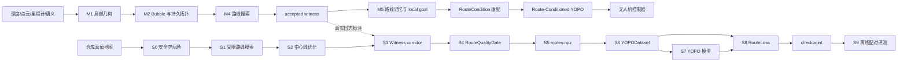
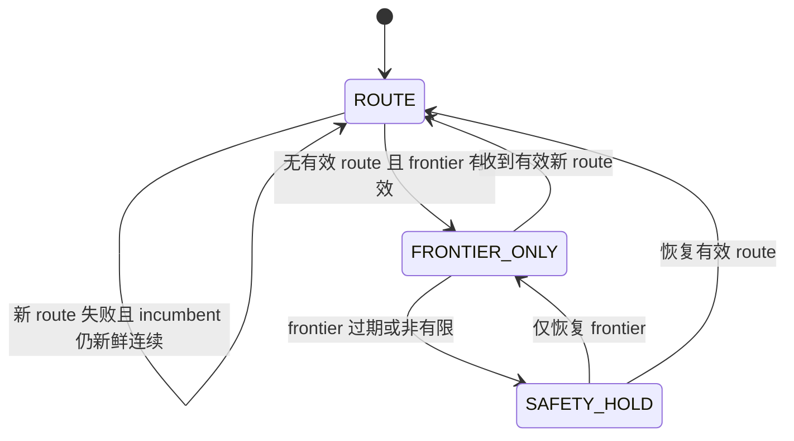

# ScaleNav Route-Conditioned YOPO 训练与在线集成详细设计说明书

| 项目 | 内容 |
|---|---|
| 文档标识 | `SCALENAV-RC-YOPO-IDD` |
| 文档版本 | `V1.0` |
| 适用软件 | `scalenav_graph_ros2`、`train_scalenav` |
| 设计层级 | 系统设计、子模块设计、函数设计、测试规格 |
| 在线规划设计 | [ALGORITHM_DESIGN.md](ALGORITHM_DESIGN.md) |
| 在线测试规格 | [FUNCTION_TEST_CASES.md](FUNCTION_TEST_CASES.md) |
| 训练结果报告 | [TRAINING_REPORT_002.md](../../train_scalenav/docs/TRAINING_REPORT_002.md) |

## 1. 系统设计

### 1.1 系统边界

EPIC 负责感知同步、持久拓扑、语义风险、frontier terminal 排序和 accepted witness
提交。Route-Conditioned YOPO 接收 accepted witness 派生的局部走廊，生成满足无人机
动力学约束的轨迹 primitive。YOPO 不重新决定全局左/右绕行，不以自身 score 覆盖 EPIC
提交的路线。

真实日志标注只消费 EPIC accepted witness。合成数据可以由 Python 真值地图搜索产生
路线标签，但该搜索器是离线标签生成器，不是第二套生产规划器；它必须采用与 M4 等价的
安全空间、中心线和质量门定义。



### 1.2 在线模块与训练子模块对应关系

| 在线模块 | 训练子模块 | 共享语义 | 不得混用的状态 |
|---|---|---|---|
| M1 局部地图 | S0 `ClearanceField` | 障碍物距离、线段安全检查 | M1 当前帧点云不写入训练 checkpoint |
| M2 Bubble/TopoGraph | S1 路线搜索 | 安全球、连通 witness | 持久 TopoNode 不是 YOPO route bubble |
| M3 语义风险 | 数据生成的路线选择条件 | 风险可影响 EPIC accepted witness | 语义持久节点不直接作为模型路线点 |
| M4 路线搜索 | S1-S4 | accepted witness、连续安全空间、质量门 | 合成 A* 不进入在线执行进程 |
| M5 路线记忆 | S5 route identity | `route_id`、stamp、frontier、有效性 | checkpoint 不保存在线 incumbent |
| M6 发布 | S6 在线预处理 | 坐标系、固定 K 个 route bubbles、mask | Dataset batch 不跨 tick 持久化 |
| YOPO/控制器 | S7-S9 | primitive 排列、score、轨迹与路线 loss | YOPO 不提交新 frontier terminal |

### 1.3 三种 Bubble 与持久化

| 对象 | 生成者 | 中心 | 半径 | 是否跨帧持久化 | 用途 |
|---|---|---|---|---:|---|
| 地图 Bubble | M2 | 当前自由空间采样点 | 局部安全空间 | 否，随 M1 快照重算 | 本帧拓扑候选 |
| TopoNode 代表 Bubble | M2 | 持久拓扑节点 | 节点安全球半径 | 是，按 persistent id 跨 rebuild 恢复 | 图搜索、边连接 |
| Witness corridor Bubble | M4 输出适配层/S3 | accepted witness 重采样点 | `clearance - robot_radius_m - safety_margin_m` | 在线否；写入 `routes.npz` 后是 | YOPO 路线条件与 loss |

Witness corridor 必须在最终 accepted witness 或优化后的中心线上重新查询障碍距离。
不得把建图 Bubble 半径直接复制为 corridor 半径，否则模型输入、route loss 和实际执行
路线会对应不同的安全空间。

### 1.4 数据流、坐标和持久化边界

在线和训练统一使用 `world_enu + body_flu`。AirSim 的 NED/FRD 数据在进入路线契约前
完成转换；`route_id` 单调递增，header stamp 表示该路线的观测时刻。

| 对象 | 存储 | 生命周期 | 写入者 | 读取者 |
|---|---|---|---|---|
| EPIC accepted witness | 内存/ROS2 消息 | 当前路线有效期，按 `route_id` 替换 | EPIC M4/M5 | M6、YOPO 适配层、日志标注器 |
| `routes.npz` 原始 witness | 数据集文件 | 数据集版本生命周期 | 离线标注器 | Dataset、校验器、评测器 |
| 固定 K 个 corridor bubbles | batch 张量 | 一次 Dataset 取样或在线 tick | Dataset/在线预处理 | YOPO 网络 |
| dense witness 与安全半径 | batch 张量 | 一次 loss/评测 | Dataset | RouteLoss、离线评测 |
| checkpoint | 模型文件 | 模型发布版本 | Trainer | 在线推理、离线评测 |
| persistent TopoGraph | 在线内存 | 任务/地图生命周期 | M2/M3 | M4/M5；不写入 checkpoint |

## 2. 子模块详细设计

### 2.1 S0 安全空间场

`ClearanceField` 统一点查询、梯度、连续线段下界和安全判定：

```text
clearance(point) -> distance_to_nearest_obstacle
gradient(point) -> clearance_ascent_direction
segment_min_clearance(a, b, max_step) -> continuous_lower_bound
is_safe(point, required_clearance) -> bool
```

合成点云使用 KD-tree 或 ESDF 实现；所有路径段以不大于配置步长的稠密采样复核。
点查询通过不能替代线段检查。

### 2.2 S1 受限路线搜索

搜索只保留满足
`clearance(p) >= robot_radius_m + safety_margin_m` 的节点和边。`robot_radius_m` 是现有
配置中的兼容字段名，表示无人机外接半径。在允许的最短路绕行比内，
先最大化路径最小安全半径，再最小化路径长度和安全空间风险。该顺序用于消除可避免的
伪细腰，同时不能用长距离绕行掩盖真实窄通道。

### 2.3 S2 Witness 中心线优化

`smooth_grid_path` 删除共线点并保持起终点，随后对中间点沿安全空间梯度小步移动。
每次移动都复核相邻线段；只有路径最小安全半径或风险改善、端点不变且曲率可执行时
才接受。优化失败保留原始可行 witness，不生成未经验证的捷径。

### 2.4 S3 Corridor 构造

`build_witness_corridor` 对最终中心线稠密采样并计算：

```text
raw_clearance[i] = ClearanceField.clearance(center[i])
safe_radius[i] = raw_clearance[i] - robot_radius_m - safety_margin_m
```

`sample_route_bubbles` 再按弧长 anchor 生成固定 `[K,4]` 表示。路线不足时重复 terminal，
但对应 `route_mask` 为 0；每个固定 Bubble 的半径取负责区间的保守最小值。

### 2.5 S4 RouteQualityGate

质量门输出 `valid`、稳定 reason flags、路线长度、连续最小安全空间、最大曲率、
Bubble overlap 和样本权重。硬拒绝项包括非有限/空路线、起终点不连续、碰撞或安全空间
不足、Bubble 断连以及超出无人机可执行曲率。任务方向、FOV、31.5 m 进度参考和语义
风险属于 loss 或置信度，不单独构成 hard reject。

### 2.6 S5 数据契约

`routes.npz` 使用数值数组和 offset 表，不使用 pickle/object array。至少保存：

```text
route_id, frame_index, route_valid, route_quality_flags
frontier_world, path_offsets, path_points_world
path_clearance_m, path_safe_radius_m
route_length_m, route_min_clearance_m, route_max_curvature_rad_m
route_weight, search_length_m, search_min_safe_radius_m
```

失败路线保留 reason flags 和可用诊断字段，不能静默丢弃。数据发布绑定生成器版本、
场景 ID、seed、坐标约定和质量门参数。

### 2.7 S6 Dataset 与模型输入

`YOPODataset.__getitem__` 输出 depth、motion、frontier、固定 route bubbles、route mask、
dense witness、dense safe radius 和 dense mask。训练/验证按 frame group 切分，同一深度帧
的多条路线不得跨 split。route dropout 同时清空固定和 dense route mask，但保留
frontier 与几何安全项。

### 2.8 S7 模型与 S8 Loss

Route-Conditioned YOPO 保留 3x5 共 15 个 primitive 的排列和 9-D endstate + 1-D score
输出，在 state transform 后融合相对 frontier 和 route features。总损失由安全、平滑、
加速度、corridor、progress、tangent 和 score regression 构成；score label 使用各项
cost 的 detached 加权和。route dropout 时路线三项为零，基础安全损失仍生效。

### 2.9 S9 评测

配对评测要求 Route-YOPO、上一正式 Route-YOPO 和 YOPO-Simple 使用相同 depth、pose、
motion、frontier 和障碍点云；两个 Route-YOPO 还使用相同 witness bubbles。输出碰撞率、
corridor violation、平均最小安全空间、进度、安全半径分桶和窄通道穿越/停车统计。
离线零 motion 单步结果不能写成闭环飞行成功率。

## 3. 在线接口与状态机

```text
RouteCondition(route_id, stamp, frame_id,
               frontier[3], centers[K,3], radii[K], mask[K],
               remaining_length_m, quality_flags, valid)
```



每次状态转换记录 `route_id`、stamp、flags、复用状态、候选 loss 分解和 reason code。
模型输出非有限、route 过期或输入坐标不一致时进入明确降级状态，不继续使用不可审计轨迹。

## 4. 函数设计索引

| 子模块 | 函数/类 | 输入 | 输出 | 失败行为 |
|---|---|---|---|---|
| 坐标 | `ned_to_enu`、`ned_frd_pose_to_enu_flu` | NED/FRD 点与姿态 | ENU/FLU 点与旋转 | shape/非有限输入拒绝 |
| 路线几何 | `polyline_arclength`、`maximum_polyline_curvature`、`resample_polyline` | `N x 3` 折线 | 弧长、曲率、稠密点 | 空/退化段返回稳定诊断 |
| 安全空间 | `ClearanceField.*`、`build_witness_corridor` | 点云、witness、半径和裕量 | 原始距离与安全半径 | 非正半径交质量门拒绝 |
| 契约 | `save_route_table`、`load_route_table` | `RouteRecord[]` | `routes.npz`/加载表 | dtype、offset、版本不符拒绝 |
| 质量门 | `RouteQualityGate.evaluate` | route、距离、start/frontier | `RouteQualityResult` | flags 非零且 `valid=false` |
| 采样 | `sample_route_bubbles` | dense route、半径、anchors | centers/radii/mask/distances | 不足 K 时 masked padding |
| Dataset | `_load_scenes`、`_split_samples`、`__getitem__`、`_read_depth`、`_random_motion` | 场景、route 和 seed | 模型及 loss 张量 | 契约错误拒绝该场景/样本 |
| 变换 | `world_to_body_flu`、`StateTransform` | 位姿、frontier、route、primitive | body-FLU route features | 非有限结果阻断 batch |
| 模型 | `YOPONetwork.forward` | depth/motion/frontier/route | 15 个 endstate/score | 在线进入安全保持 |
| 损失 | `RouteLoss.forward`、`_coefficients`、`_positions` | primitive 与 dense route | corridor/progress/tangent | mask 全零时路线项为零 |
| 训练 | `YopoTrainer` checkpoint/score label | batch、cost、配置 | 梯度、指标、checkpoint | 不保存非有限 best model |
| 评测 | trajectory reconstruction/corridor metrics | checkpoint、配对样本 | 安全与进度指标 | 样本错误单独记录，不改分母 |

## 5. 测试规格

### 5.1 状态和规模

训练侧用例与在线 `TC-M*/MT-M*/IT-*` 分开编号，避免把 Python 标签生成测试算作在线
规划验证。

| 层级 | 编号 | 数量 | 当前覆盖表达 |
|---|---|---:|---|
| 单元测试 | `UT-RC-001` - `UT-RC-041` | 41 | 有测试代码或测试设计；以逐项状态为准 |
| 模块测试 | `MT-RC-001` - `MT-RC-008` | 8 | 多数有代码，仍需数据/场景复核 |
| 集成测试 | `IT-RC-001` - `IT-RC-008` | 8 | 单 batch/标注器部分已有；在线闭环待执行 |
| 性能测试 | `PERF-RC-001` - `PERF-RC-005` | 5 | 测试设计已定义 |
| 合计 |  | 62 | 不计入在线 151 项统计 |

“已有测试代码”只表示仓库存在入口；“已执行通过”必须有命令输出、报告或可追溯批次。
训练侧 CHG-0003 记录当前 `train_scalenav/tests` 为 `45 passed`，但该汇总不自动把所有
62 项场景和性能用例标为通过。

### 5.2 单元测试用例

| ID | 函数/对象 | 输入 -> 输出 | 运行频率 | 预期结果 | 次数 | 重要性 | 状态/入口 |
|---|---|---|---|---|---:|---|---|
| UT-RC-001 | `ned_to_enu` | NED 单位轴/批量点 -> ENU 点 | 数据导入 | x/y 交换、z 取反、有限性保持 | 3 组 | P0 | 已有代码：`test_coordinates.py` |
| UT-RC-002 | `ned_frd_pose_to_enu_flu` | 单位姿态/FRD 四元数 -> ENU 位姿 | 数据导入 | FLU 轴正确、旋转正交 | 2 组 | P0 | 已有代码：`test_coordinates.py` |
| UT-RC-003 | world/body 往返 | 随机位姿和点 -> 往返点 | Dataset 取样 | 误差 `<=1e-5 m` | 100 组 | P0 | 已有代码：`test_coordinates.py` |
| UT-RC-004 | `polyline_arclength` | 折线/重复点 -> 弧长 | 路线校验 | 累积单调、重复点不增长 | 20 组 | P0 | 测试设计已定义 |
| UT-RC-005 | `maximum_polyline_curvature` | 直线/拐角 -> 最大曲率 | 路线校验 | 直线为零、急转可标记 | 20 组 | P1 | 测试设计已定义 |
| UT-RC-006 | `resample_polyline` | 不同段长/重复端点 -> 稠密点 | 每条路线 | 间距受限、端点不变 | 20 组 | P0 | 已有代码：`test_route_contract.py` |
| UT-RC-007 | `build_witness_corridor` | witness/障碍/裕量 -> 距离与半径 | 每条路线 | 半径公式正确、值有限 | 20 组 | P0 | 已有代码：`test_route_contract.py` |
| UT-RC-008 | route table 读写 | `RouteRecord[]` -> `routes.npz`/表 | 数据发布 | 无 pickle 往返、dtype/offset 一致 | 5 场景 | P0 | 已有代码：`test_route_contract.py` |
| UT-RC-009 | 质量门有效路线 | 安全前向路线 -> 质量结果 | 每条路线 | `flags=NONE` 且指标有限 | 10 组 | P0 | 已有代码：`test_route_contract.py` |
| UT-RC-010 | 质量门拒绝 | 反向/阻塞/断连/低安全空间 -> flags | 每条路线 | 对应 flag 置位、`valid=false` | 每种 3 组 | P0 | 已有代码：`test_route_contract.py` |
| UT-RC-011 | 质量门非法值 | NaN/Inf/空/错误 shape -> flags | 输入校验 | 明确拒绝、诊断无 NaN | 每种 3 组 | P0 | 已有代码：`test_route_contract.py` |
| UT-RC-012 | `sample_route_bubbles` | dense witness/anchors -> K 个 Bubble | Dataset 取样 | padding mask 正确、半径保守 | 30 组 | P0 | 已有代码：`test_route_contract.py` |
| UT-RC-013 | `_load_scenes` | 场景元数据/route -> `SceneData` | Dataset 初始化 | 仅接受约定坐标、拒绝重复 frame | 每种 3 组 | P0 | 测试设计已定义 |
| UT-RC-014 | `_split_samples` | 多场景样本 -> train/valid 索引 | Dataset 初始化 | 按 frame group 切分、无泄漏 | 10 组 | P0 | 已有代码：`test_training_pipeline.py` |
| UT-RC-015 | `__getitem__` | 场景/route index -> 全部张量 | 每个 batch | shape 合约一致且有限 | 100 样本 | P0 | 测试设计已定义 |
| UT-RC-016 | `_read_depth` | EXR/NaN/Inf -> 归一化深度 | 每个样本 | 裁剪 `[0,1]`，无效值取最大深度 | 30 张 | P0 | 已有代码：`test_snapshot_dataset.py` |
| UT-RC-017 | `_random_motion` | seed/速度配置 -> motion | 每个样本 | 范围满足且 seed 可复现 | 1000 次 | P1 | 测试设计已定义 |
| UT-RC-018 | route 坐标预处理 | world route/位姿 -> body-FLU route | 每个样本 | 训练在线同变换、方向一致 | 100 组 | P0 | 已有代码：`test_training_pipeline.py` |
| UT-RC-019 | route dropout | route 与概率 0/1 -> masks | 每个 batch | route masks 同时清零、frontier 保留 | 每种 20 batch | P0 | 已有代码：`test_training_pipeline.py` |
| UT-RC-020 | `RouteLoss.forward` | primitive/dense route -> 三项 loss | 每个 batch | `[B]`、越界轨迹代价更高 | 20 batch | P0 | 已有代码：`test_route_loss.py` |
| UT-RC-021 | dropout loss | 全零 route mask -> 三项 loss | dropout batch | 路线项全零、基础损失不变 | 20 batch | P0 | 已有代码：`test_route_loss.py` |
| UT-RC-022 | 多项式重建 | 导数/时间 -> 位置 | 每个 batch | 边界条件满足、无 NaN | 20 batch | P0 | 测试设计已定义 |
| UT-RC-023 | `StateTransform` route branch | frontier/Bubble/primitive -> route feature | 每次 forward | 每个 primitive 相对特征与 shape 正确 | 50 batch | P0 | 测试设计已定义 |
| UT-RC-024 | `YOPONetwork.forward` | 标准 batch -> 15 个 endstate/score | 每次推理 | 输出维度与有限性正确 | 100 batch | P0 | 测试设计已定义 |
| UT-RC-025 | 模型反事实路线 | 同 depth/frontier、左右 witness -> 两组输出 | 模型回归 | 路线变化造成可解释排序差异 | 30 对 | P1 | 已有代码：`test_training_pipeline.py` |
| UT-RC-026 | score label | detached costs -> score target | 每个 batch | 等于各 cost 加权和 | 20 batch | P0 | 测试设计已定义 |
| UT-RC-027 | 真值绕障搜索 | 大方块/起终点 -> witness | pilot 场景 | 不穿障碍且存在绕行 | 10 场景 | P0 | 已有代码：`test_ground_truth_dataset.py` |
| UT-RC-028 | 解析深度渲染 | 障碍/相机位姿 -> depth | pilot 场景 | 能看到障碍、单位和有限性正确 | 10 姿态 | P0 | 已有代码：`test_ground_truth_dataset.py` |
| UT-RC-029 | 真值数据 writer | 配置/seed/routes -> 数据目录 | pilot 发布 | 文件合同完整且 Dataset 可读 | 3 次 | P0 | 已有代码：`test_ground_truth_dataset.py` |
| UT-RC-030 | `PoseSampler` | 点云/边界/安全距离 -> 位姿/统计 | 采样任务 | 近障碍、越界、无效深度拒绝 | 1000 次 | P0 | 已有代码：`test_snapshot_dataset.py` |
| UT-RC-031 | `SceneWriter` | RGB-D/位姿/tree/缺帧 -> 场景或错误 | 采集任务 | 完整回读、缺项明确失败 | 每种 3 组 | P1 | 已有代码：`test_snapshot_dataset.py` |
| UT-RC-032 | 采样确定性 | 同 seed/边界 -> 两序列 | 数据回归 | 序列一致且均在边界 | 10 对 | P1 | 已有代码：`test_snapshot_dataset.py` |
| UT-RC-033 | BGR -> RGB | BGR 响应 -> RGB 文件 | 快照采集 | 只转换一次、不交换深度 | 3 组 | P1 | 已有代码：`test_snapshot_dataset.py` |
| UT-RC-034 | msgpack 图像解码 | binary payload -> RGB/depth | 快照采集 | 尺寸正确、非法 payload 失败 | 6 组 | P1 | 已有代码：`test_snapshot_dataset.py` |
| UT-RC-035 | `SceneCollector` | 多姿态/mock 服务 -> frames | 采集任务 | 每请求恰写一帧、index 不重复 | 5 组 | P1 | 已有代码：`test_snapshot_dataset.py` |
| UT-RC-036 | 缺 frame 校验 | 缺声明 frame -> 错误 | 数据发布 | 拒绝并指出 frame index | 3 组 | P0 | 已有代码：`test_snapshot_dataset.py` |
| UT-RC-037 | semantic heatmap 校验 | 有/无 heatmap -> 结果 | 语义数据发布 | require 开关行为一致 | 4 组 | P1 | 已有代码：`test_snapshot_dataset.py` |
| UT-RC-038 | Unreal 坐标转换 | cm mesh/transform -> NED m 点云 | 地图导出 | 单位和轴正确、点云有限 | 3 mesh | P1 | 已有代码：`test_snapshot_dataset.py` |
| UT-RC-039 | 人员近似点 | 姿态/包围盒 -> 点集 | 动态物体合并 | 坐标、点数、有限性正确 | 10 组 | P1 | 已有代码：`test_snapshot_dataset.py` |
| UT-RC-040 | 人员点合并 | tree/人员点 -> 合并点云 | 地图导出 | 原点保留、追加格式正确 | 5 组 | P1 | 已有代码：`test_snapshot_dataset.py` |
| UT-RC-041 | binary PLY 拒绝 | binary PLY -> 校验错误 | 地图校验 | 不静默误读坐标 | 3 组 | P1 | 已有代码：`test_snapshot_dataset.py` |

### 5.3 模块测试用例

| ID | 模块 | 输入 -> 输出 | 运行频率 | 预期结果 | 次数 | 重要性 | 状态 |
|---|---|---|---|---|---:|---|---|
| MT-RC-001 | 采集/采样/writer | 点云、姿态、深度 -> Scene 目录 | 每次 pilot | 坐标、frame、tree 可回读 | 3 场景 | P0 | 已有代码，待场景复核 |
| MT-RC-002 | 搜索/corridor | Map2/森林/seed -> route 表 | 每次 pilot | 绕障通过质量门、失败保留 flags | 2 地图 x 10 seed | P0 | 已有代码，待场景复核 |
| MT-RC-003 | EPIC labeler/质量门 | JSONL witness/点云 -> routes/report | 日志标注 | 只消费 accepted witness，审计一致 | 100 route | P0 | 已有代码，待场景复核 |
| MT-RC-004 | Dataset/route transform | 两场景数据 -> 模型与 loss batch | 每 epoch | 固定/dense route 同源、split 无泄漏 | 10 epoch | P0 | 已有代码，待场景复核 |
| MT-RC-005 | Dataset/network | batch/左右 route -> endstate/score | validation epoch | route 可区分、shape/finite 保持 | 5 epoch | P0 | 测试设计已定义 |
| MT-RC-006 | network/全部 loss | primitive/ESDF/route -> cost/gradient | 每 epoch | 可反传、dropout 无路线梯度 | 5 epoch | P0 | 已有代码，待场景复核 |
| MT-RC-007 | Trainer/checkpoint | 配置/batch/旧模型 -> best model | 模型发布 | 版本/route/loss 参数可 reload | 3 次 | P1 | 已有代码，待场景复核 |
| MT-RC-008 | 校验器/viewer | 合法非法场景 -> 报告/路线图 | 数据发布 | reason 可定位、三维字段保留 | 100 route | P1 | 测试设计已定义 |

### 5.4 集成测试用例

| ID | 集成范围 | 输入 -> 输出 | 运行频率 | 预期结果 | 次数 | 重要性 | 状态 |
|---|---|---|---|---|---:|---|---|
| IT-RC-001 | 场景到 backward | 双场景 depth/route/ESDF -> gradient/checkpoint | 每次提交 | forward/backward/save 无 NaN | 5 次 | P0 | 已有代码，待场景复核 |
| IT-RC-002 | route 文件闭环 | 100 条有效/失败 route -> Dataset 统计 | 每次 pilot | 比例、flags、安全空间统计可复现 | 3 次 | P0 | 测试设计已定义 |
| IT-RC-003 | EPIC 日志标注 | accepted witness JSONL -> route 表/报告 | 每批日志 | 不重写生产搜索、原始 witness 可追溯 | 2 批 | P0 | 已有测试，待场景复核 |
| IT-RC-004 | route dropout | 正常/dropout batch -> 输出/loss | 训练回归 | 仅路线被屏蔽，frontier/安全项工作 | 10 对 | P0 | 已有代码，待场景复核 |
| IT-RC-005 | ROS2 原子接口 | route id/stamp/bubbles/flags -> 三级状态 | 每 tick | 过期/回退/非连续 route 拒绝 | 每状态 20 次 | P0 | 测试设计已定义 |
| IT-RC-006 | export/reload | checkpoint/固定 batch -> 导出输出 | 模型发布 | 前后 shape、finite、排列一致 | 3 模型 | P1 | 测试设计已定义 |
| IT-RC-007 | 在线闭环 | 语义噪声/左右路线 -> 轨迹/状态 | 每条任务 | 不振荡、失效有 reason、到达终点 | 3 往返 | P0 | 测试设计已定义 |
| IT-RC-008 | 统一 loss 反事实 | 27 m 安全/32 m 高风险 -> terminal/loss | planner 回归 | 可行点统一排序、换权重结果可预测 | 每组 30 次 | P0 | 测试设计已定义 |

### 5.5 资源与性能测试

| ID | 对象 | 输入 -> 输出 | 运行频率 | 预期结果 | 次数 | 重要性 | 状态 |
|---|---|---|---|---|---:|---|---|
| PERF-RC-001 | ESDF/tile 内存 | 点云/0.2 m/tile -> 字节/误差 | 场景版本 | 不载入超预算全图、边界误差受限 | 2 场景 x 3 | P0 | 测试设计已定义 |
| PERF-RC-002 | Dataset RSS | batch 1/8/32、K 8/12/16 -> RSS/时间 | 训练版本 | 内存增长可解释、无 route 全量复制 | 每组 5 次 | P1 | 测试设计已定义 |
| PERF-RC-003 | YOPO latency | 固定 batch -> P50/P95/max | 模型发布 | P95 `<=` 控制周期 25% | 1000 tick | P0 | 测试设计已定义 |
| PERF-RC-004 | RouteLoss 资源 | primitive/M -> 时间/显存/梯度 | 训练版本 | M 增长无失控、dropout 可完成 | 每组 100 batch | P1 | 测试设计已定义 |
| PERF-RC-005 | 在线 route 预处理 | K/切换/过期 -> 延迟/字节/状态 | ROS2 tick | 不阻塞控制、超时明确降级 | 1000 tick | P0 | 测试设计已定义 |

性能记录必须包含场景、route 数、点云点数、CPU/GPU、峰值内存以及 P50/P95/最大值；
功能正确不能替代性能通过。

## 6. 已执行证据与验收

训练侧 `CHG-0003` 记录 Python 测试 `45 passed`。`pilot_002` 含三个场景共 2250 条路线；
`benchmark_003` 使用独立 seed，含三个场景共 1800 条配对样本。最终 `YOPO_6` 的离线
碰撞率为 `0.33% (6/1800)`，corridor violation 为 `8.67%`，平均最小安全空间为
`1.358 m`，平均进度为 `4.230 m`。详细分场景结果及限制见
[TRAINING_REPORT_002.md](../../train_scalenav/docs/TRAINING_REPORT_002.md)。

发布验收还必须满足：

1. 在线 accepted witness 是生产路线的唯一来源，YOPO 不改变 terminal 或全局绕行侧。
2. `routes.npz`、模型输入和 loss 使用同一条最终 witness 及同一安全空间定义。
3. 所有 P0 数据契约、质量门、前向反向传播和在线原子接口用例通过。
4. 闭环场景无左右振荡、无碰撞，并最终到达 mission goal。
5. 推理和在线预处理满足控制周期预算；离线单步指标不得替代闭环验收。

## 7. 来源与追溯

本说明书将训练侧架构、测试矩阵和已执行结果纳入 `scalenav_ws/docs` 的统一索引。详细
训练演进仍由下列原始记录保存，不在本文件中改写历史批次：

- [训练架构](../../train_scalenav/docs/ARCHITECTURE.md)
- [训练侧详细测试矩阵](../../train_scalenav/docs/TODO_001_DESIGN_TEST_CHANGELOG.md)
- [训练侧变更记录](../../train_scalenav/docs/CHANGELOG.md)
- [Batch 002 训练与离线评测报告](../../train_scalenav/docs/TRAINING_REPORT_002.md)
