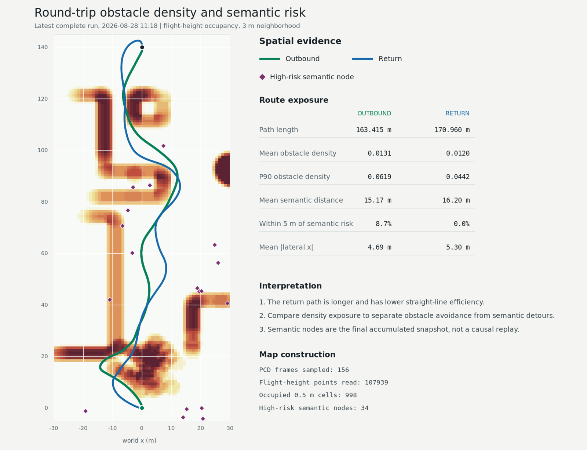

# 去程建图与回程效率对照实验

## 1. 实验目的

验证无人机完成去程后，M2 持久拓扑图是否在回程复用，以及复用是否减少建图、路线选择和
端到端飞行开销。本实验与“能够完成往返”的功能验收分开；到达两个 mission goal 只是实验
有效性的前提，不直接等于效率提高。

## 2. 实验设计

### 2.1 路线与控制变量

- 去程：`(0,0,1.6) -> (0,140,1.6)`。
- 回程：`(0,140,1.6) -> (0,0,1.6)`。
- 同一轮去程和回程使用同一个 `epic_graph_node` 进程，不清空 graph 和 semantic memory。
- depth、semantic、planner 和 odom 保持各次会话原有配置。
- 去程和回程均以 planner 的 `new mission goal` 为起点，以 `mission complete` 为终点。
- 轨迹长度由结构化日志中的 100 Hz odom 相邻采样积分得到。

### 2.2 观测量

| 类别 | 指标 | 判定用途 |
|---|---|---|
| graph 复用 | goal 日志中的 `graph`、`reuse`、`semantic_memory` | 确认回程未重新初始化空图 |
| 几何建图 | 每次 background rebuild 的 `inserted`、`remained` | 区分真正的新建节点和去程节点复用 |
| 路线稳定 | route switch 总数及原因 | 判断已知路线是否减少 frontier 切换 |
| 在线计算 | update 与 background rebuild 的 mean/P50/P95/max | 判断复用是否转化为计算耗时下降 |
| 飞行效率 | 完成时间、odom 轨迹长度、直线距离/轨迹长度、平均速度 | 区分飞得更快和路线更短 |

### 2.3 通过条件

单轮 graph 复用有效需同时满足：

1. 回程 goal 为 `REUSE_EXISTING_GRAPH` 或 `REUSE_EXPANDED_GRAPH`，不得为 `REBUILD_GRAPH`；
2. 回程不得出现 background initialize；
3. 回程每次 rebuild 的平均 `inserted` 比去程至少下降 30%；
4. 回程 `remained` 持续非零，证明旧几何拓扑进入重建差分。

整体效率提高需在不少于 10 次完整往返中满足：

1. 回程完成时间中位数比去程至少降低 5%；
2. 回程轨迹长度不得增加超过 5%；
3. 回程 update P95 不得增加超过 5%，且 background rebuild P95 不得增加超过 5%；
4. 回程路线切换次数中位数不高于去程；
5. 两段都完成任务，且无碰撞、emergency stop、路线倒退或不连续 witness 拒绝。

## 3. 日志与样本

| 轮次 | EPIC 日志 | 结构化会话 | planner 日志 |
|---|---|---|---|
| 1 | `/home/puffy/.ros/log/epic_graph_node_3084714_1787886316676.log` | `log_scalenav/session_20260828_110516_752/` | `/home/puffy/.ros/log/python_3084667_1787886317636.log` |
| 2 | `/home/puffy/.ros/log/epic_graph_node_3093732_1787887136941.log` | `log_scalenav/session_20260828_111856_991/` | `/home/puffy/.ros/log/python_3093671_1787887137848.log` |

轮次 2 在正式去程前先有一个原点 goal，用于等待系统进入稳定状态；正式对照仍从
`(0,0) -> (0,140)` 开始。该去程 goal 为 `REUSE_EXPANDED_GRAPH`，当时只有起点附近图和
27 条 semantic memory；回程 goal 为 `REUSE_EXISTING_GRAPH`，已有完整去程拓扑和 1028 条
semantic memory。

## 4. 实验结果

### 4.1 graph 构建与路线选择

| 指标 | 轮次 1 去程 | 轮次 1 回程 | 轮次 2 去程 | 轮次 2 回程 |
|---|---:|---:|---:|---:|
| goal graph 状态 | `REBUILD_GRAPH` | `REUSE_EXPANDED_GRAPH` | `REUSE_EXPANDED_GRAPH` | `REUSE_EXISTING_GRAPH` |
| goal 时 semantic memory | 0 | 1059 | 27 | 1028 |
| background rebuild 次数 | 19 | 17 | 18 | 18 |
| `inserted` 总数 | 81 | 27 | 57 | 22 |
| 平均 `inserted/rebuild` | 4.26 | 1.59 | 3.17 | 1.22 |
| `inserted/rebuild` 变化 | - | **-62.7%** | - | **-61.5%** |
| 平均 `remained/rebuild` | 35.95 | 43.18 | 38.44 | 40.22 |
| route switch | 18 | 12 | 15 | 10 |
| route switch 变化 | - | **-33.3%** | - | **-33.3%** |

两轮回程都没有重新初始化空图。平均新增几何节点下降超过 60%，同时 retained 节点保持非零并
略有增加，证明去程建立的 M2 持久拓扑确实参与回程，而不是只复用了同名进程或 M1 局部点云。

### 4.2 在线计算耗时

单位均为 ms。

| 指标 | 轮次 1 去程 | 轮次 1 回程 | 轮次 2 去程 | 轮次 2 回程 |
|---|---:|---:|---:|---:|
| update mean | 40.522 | 41.021 | 21.749 | 22.486 |
| update P50 | 23.713 | 22.311 | 12.618 | 12.892 |
| update P95 | 95.823 | 90.535 | 50.289 | 50.662 |
| update max | 96.729 | 99.251 | 63.359 | 85.876 |
| rebuild mean | 71.205 | 86.530 | 55.170 | 64.889 |
| rebuild P50 | 61.446 | 69.363 | 47.390 | 60.727 |
| rebuild P95 | 126.354 | 145.308 | 71.261 | 93.537 |
| rebuild max | 142.224 | 149.777 | 91.323 | 99.178 |

回程 update P95 基本持平，但 background rebuild 明显更慢：mean 分别增加 21.5% 和 17.6%，
P95 分别增加 15.0% 和 31.3%。因此“新增节点更少”没有转化为端到端计算加速。日志中回程开始
时 semantic memory 已达到 1028--1059 条，并在回程继续增长；global graph 和语义工作集扩大，
抵消了几何节点复用收益。

### 4.3 飞行时间与轨迹

| 指标 | 轮次 1 去程 | 轮次 1 回程 | 轮次 2 去程 | 轮次 2 回程 |
|---|---:|---:|---:|---:|
| 完成时间 | 40.557 s | 36.976 s | 38.385 s | 37.876 s |
| 回程时间变化 | - | **-8.8%** | - | **-1.3%** |
| odom 轨迹长度 | 172.753 m | 174.935 m | 163.417 m | 170.963 m |
| 回程长度变化 | - | **+1.3%** | - | **+4.6%** |
| 直线效率 | 0.8107 | 0.8007 | 0.8566 | 0.8190 |
| 平均速度 | 4.260 m/s | 4.731 m/s | 4.259 m/s | 4.515 m/s |

两次回程完成时间都更短，但轨迹都更长、直线效率都更低。时间改善主要来自平均速度提高，不能
归因于 graph 复用产生了更短路线。轮次 1 达到 5% 时间改善，轮次 2 没有达到。

### 4.4 障碍物密度热图与语义空间关系

热图使用轮次 2 的 156 帧占据点云。每帧点云按同时间 odom 变换到世界坐标，只保留
`z=0.3..3.2 m` 的飞行高度障碍，合并为 998 个 `0.5 m` 占据栅格；颜色表示 3 m 邻域内的占据
比例。紫色菱形为整轮结束时 graph snapshot 中、与飞行层垂向距离不超过 4 m 的高风险语义节点。

| 空间指标 | 去程 | 回程 | 回程变化 |
|---|---:|---:|---:|
| 平均障碍物密度 | 0.0131 | 0.0120 | -8.2% |
| P90 障碍物密度 | 0.0619 | 0.0442 | -28.6% |
| 最大障碍物密度 | 0.1947 | 0.1681 | -13.6% |
| 到高风险语义节点平均距离 | 15.17 m | 16.20 m | +6.8% |
| 到高风险语义节点最小距离 | 2.56 m | 6.93 m | +170.8% |
| 进入高风险语义节点 5 m 范围的轨迹比例 | 8.7% | 0.0% | -8.7 个百分点 |
| 平均横向偏移 `abs(x)` | 4.69 m | 5.30 m | +12.9% |
| 轨迹长度 | 163.42 m | 170.96 m | +4.6% |

回程的横向偏移和轨迹长度更大，但经过区域的障碍密度更低，并且没有进入最终高风险语义节点的
5 m 范围。空间结果与“规划器选择更稀疏、且远离语义风险的走廊”一致。回程在线日志同时记录
更高的平均 route risk（`0.1168`，去程为 `0.0601`）和语义代价（`3.897`，去程为 `1.218`），
说明回程面对的是去程后已经增长的语义工作集，不是相同风险场下的简单反向执行。

这张热图不能单独证明改道由语义造成，原因有三点：

1. 去程和回程的相机朝向相反，语义观测集合不同；
2. 图中的高风险语义节点来自整轮结束快照，包含回程之后才稳定的记录；
3. 回程同时远离障碍密集区和语义节点，几何安全代价本身也可能产生相同改道。

因果判定需要对同一份 odom/depth/semantic 日志做两次确定性回放：一组使用现行语义权重，一组将
语义 loss 权重置 0，其余权重、graph 初态和随机种子完全一致。若开启语义后路线在相同障碍密度
下显著增大高风险语义距离，且几何安全空间不降低，才能判定改道由语义项贡献。

生成文件：

- [`round_trip_obstacle_density_20260828.png`](round_trip_obstacle_density_20260828.png)
- [`round_trip_obstacle_density_20260828.svg`](round_trip_obstacle_density_20260828.svg)
- [`round_trip_obstacle_density_20260828_metrics.json`](round_trip_obstacle_density_20260828_metrics.json)
- [`analyze_round_trip_density.py`](analyze_round_trip_density.py)

## 5. 判定

| 判定项 | 结果 | 说明 |
|---|---|---|
| 去程 graph 在回程持久化复用 | 通过 | 两轮均为 REUSE，回程没有 background initialize |
| 回程几何建图工作减少 | 通过 | `inserted/rebuild` 分别下降 62.7% 和 61.5% |
| 回程路线切换减少 | 通过 | 两轮均下降 33.3% |
| 回程在线计算更快 | 失败 | update 未明显改善，rebuild mean/P95 均变差 |
| 回程路线更短 | 失败 | 两轮轨迹长度分别增加 1.3% 和 4.6% |
| 回程任务时间更短 | 部分通过 | 两轮分别改善 8.8% 和 1.3%，只有一轮达到 5% |
| 回程远离障碍密集区 | 通过（轮次 2） | 平均/P90 障碍物密度分别下降 8.2%/28.6% |
| 回程远离最终高风险语义节点 | 通过（空间相关性） | 最小距离 2.56 -> 6.93 m，5 m 内轨迹比例 8.7% -> 0% |
| 改道由语义项造成 | 尚不能判定 | 缺少相同日志下语义权重开启/关闭的确定性 A/B 回放 |
| 整体效率提高 | 部分通过 | 只有 2/10 次样本，且计算和路径指标没有同步改善 |

## 6. 结论

去程建立的 graph 对回程有实际作用：几何节点新增量下降约 62%，路线切换下降约 33%。但当前
不能说“回程整体效率明显提高”。回程只是完成时间略短，轨迹更长，background rebuild 更慢；
现有证据更接近“拓扑复用成功，但语义记忆增长和持续重建抵消了计算收益”。

最新一轮的空间热图进一步表明，回程路线同时避开了障碍密集区和最终高风险语义节点。这个结果
支持语义可能参与改道，但不能排除几何安全代价。正式结论需增加语义权重为 0 的同日志回放组。

后续至少再执行 8 次同配置往返，并分别统计 geometric persistent nodes 和 semantic virtual
nodes。否则只看 global node 总数，无法判断计算开销来自已知几何拓扑还是持续增长的语义记录。
