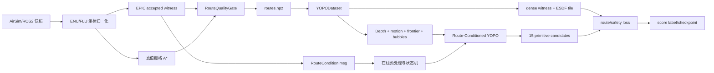
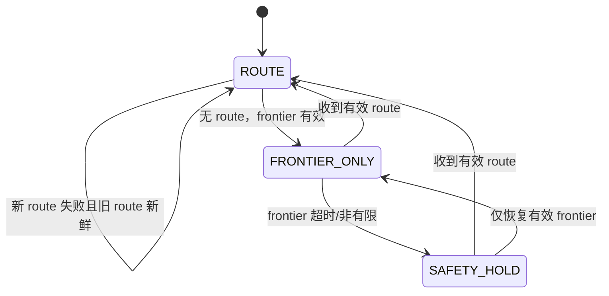

# TODO-001 Route-Conditioned YOPO 设计、测试与变更记录

## 1. 详细设计

### 1.1 系统边界

Route-Conditioned YOPO 只负责把已验收的路线条件转换为局部轨迹候选并计算训练损失。
路线搜索、拓扑持久化和语义证据管理仍由 EPIC/TopoGraph 负责。生产系统不在 YOPO
内部复制路线搜索算法，双方通过 `RouteCondition` 原子契约连接。



### 1.2 持久化边界

| 对象 | 生成位置 | 是否跨帧持久化 | 生命周期 | 允许修改者 |
|---|---|---:|---|---|
| RGB-D、位姿、`tree.ply` | 快照采集器 | 是 | 数据集生命周期 | 采集器/校验器 |
| EPIC accepted witness | 在线 EPIC | 否，按 `route_id` 替换 | 当前路线有效期 | EPIC |
| `routes.npz` 原始 witness | 离线标注器 | 是 | 数据集版本生命周期 | 标注器 |
| Dataset 固定 bubbles | `YOPODataset.__getitem__` | 否 | 一个 batch | Dataset |
| dense route / ESDF tile | Dataset/loss | 否 | 一个 loss 计算 | Loss |
| 模型 checkpoint | Trainer | 是 | 训练发布版本 | Trainer |

`TopoGraph` 的持久化节点、边和语义记录不属于本批次模型输入；在线 route 只以单调
递增 `route_id` 和有限 header stamp 为有效身份。新 route 失败时仅可复用仍新鲜、连续
且未阻塞的旧 route；否则进入 `FRONTIER_ONLY` 或 `SAFETY_HOLD`。

### 1.3 数据流和接口契约

| 阶段 | 输入 | 输出 | 失败处理 |
|---|---|---|---|
| 坐标归一化 | NED/FRD 位姿、点云 | ENU/FLU 数组 | shape/有限性错误拒绝 |
| 路线标注 | 起点、frontier、EPIC 或真值地图 | witness、clearance、bubbles | 保存 `route_quality_flags` |
| 质量校验 | 路线数组、起终点、配置 | `RouteQualityResult` | hard flag 非零则 `route_valid=0` |
| Dataset 预处理 | 有效 route、当前位姿 | `[K,4]` bubbles、dense route | 尾部重复 terminal |
| 模型推理 | depth、motion、frontier、route | 15 个 primitive endstate/score | 非有限输出进入安全停机 |
| 训练损失 | primitive、dense route、ESDF | corridor/progress/tangent/total | 无有效 route 时关闭路线项 |

```text
evaluate_route(path[N,3], clearance[N], radius[N], start[3], frontier[3])
  -> valid, flags, path_length_m, minimum_clearance_m,
     maximum_curvature_rad_m, weight
sample_route_bubbles(path[N,3], radius[N], anchors[K])
  -> centers[K,3], radii[K], sample_distances[K]
RouteCondition(route_id, stamp, frontier[3], centers[K,3], radii[K],
               remaining_length_m, quality_flags, valid)
RouteLoss(fixed_derivatives[B,3,3], decision_derivatives[B,3,3],
          dense_route[B,M,3], dense_radius[B,M])
  -> corridor[B], progress[B], tangent[B]
```

### 1.4 质量门与在线状态机

硬约束包括路线提交状态、有限性、起终点连续性、连续安全空间、Bubble 覆盖、执行
时域、曲率/lattice 可达性以及在线版本新鲜度。任务方向、FOV、31.5 m 进度目标和
语义风险只进入统一 loss，不单独造成 hard reject。



每次切换记录 `route_id`、输入 stamp、状态、全部 flags、旧 route 是否复用、候选 loss
分解和 reason code。单帧或单行语义响应不能绕过质量门和路线滞回。

### 1.5 资源预算和可追溯性

按场景、样本、在线 tick 记录点云点数、ESDF/tile 字节数、Dataset RSS、训练显存、
推理/loss 延迟和 ROS2 消息字节数。推理 P95 目标不超过控制周期 25%，路线预处理
P95 不超过一个控制周期；超预算只能切换 tile 或降级状态，不能静默降低安全空间约束。

每条路线由 `scene_id + frame_index + route_seed + route_id` 重放。失败记录保存输入摘要、
首个失败阶段、全部 flags、最小安全空间、路径长度、最大曲率和生成器版本。checkpoint
绑定数据版本、anchor、loss 权重和 git 版本。

## 2. 测试用例

### 2.1 文档范围

本页只覆盖 TODO-001 的路线条件、数据制作、Dataset、模型输入、路线损失和训练闭环。
TopoGraph 持久化、语义节点代际和 frontier 统一 loss 的既有验收仍以
[`FUNCTION_TEST_CASES.md`](FUNCTION_TEST_CASES.md) 和对应 `CHG-*` 记录为准，不在此页
重新编号。

测试不是自动化脚本清单，而是验收矩阵。每条用例都规定输入、输出、执行频率、判定、
执行次数和重要性；是否已有测试以“测试状态”字段表示。

测试状态取值：

| 状态 | 含义 |
|---|---|
| 已有测试代码 | 仓库已有对应测试函数或 smoke test；本页不据此声称本次运行通过 |
| 测试设计已定义 | 已规定场景和判定，尚未找到对应仓库测试实现 |
| 已有测试，待场景复核 | 有测试代码，但还需要真实路线/资源/闭环场景证据 |

当前 Python 环境缺少 `pytest`（`No module named pytest`），因此本页不新增“已通过”结论。
已有测试代码的具体位置均列在“实现/测试入口”列。

### 2.2 单元测试

#### 2.2.1 坐标与路线契约

| 用例 ID | 被测函数 | 输入 | 输出 | 频率 | 预期结果 | 次数 | 重要性 | 测试状态 | 实现/测试入口 |
|---|---|---|---|---|---|---:|---|---|---|
| UT-RC-001 | `ned_to_enu` | NED 单位轴、批量点 | ENU 点 | 每次数据导入 | x/y 交换，z 取反，形状和有限性保持 | 3 组 | P0 | 已有测试代码 | `test_coordinates.py::test_ned_to_enu_axes` |
| UT-RC-002 | `ned_frd_pose_to_enu_flu` | 单位姿态、FRD 四元数 | ENU 位姿和旋转矩阵 | 每次数据导入 | FLU 轴方向正确，旋转矩阵正交 | 2 组 | P0 | 已有测试代码 | `test_coordinates.py::test_identity_ned_frd_pose_maps_flu_axes_correctly` |
| UT-RC-003 | `world_to_body_flu` / `body_to_world_flu` | 随机位姿和点 | 往返点坐标 | 每次 Dataset 取样 | 往返误差不超过 `1e-5 m` | 100 组 | P0 | 已有测试代码 | `test_coordinates.py::test_world_to_body_round_trip` |
| UT-RC-004 | `polyline_arclength` | Nx3 折线、重复点 | 累积弧长和总长 | 每次路线校验 | 累积值单调，重复点不增加长度 | 20 组 | P0 | 测试设计已定义 | `route_contract.py` |
| UT-RC-005 | `maximum_polyline_curvature` | 直线、单拐角、急转折线 | 最大曲率 | 每次路线校验 | 直线为零，超过阈值的路线可被标记 | 20 组 | P1 | 测试设计已定义 | `route_contract.py` |
| UT-RC-006 | `resample_polyline` | 不同段长、重复端点、`max_step` | 稠密点和插值值 | 每条路线 | 点间距不超过 `max_step`，端点不变，值线性插值 | 20 组 | P0 | 已有测试代码 | `test_route_contract.py::test_fixed_and_dense_route_sampling_is_conservative` |
| UT-RC-007 | `build_witness_corridor` | witness、障碍点、机器人半径和安全裕量 | 稠密点、原始距离、安全半径 | 每条有效路线 | `radius = clearance - robot_radius - safety_margin`，无非有限值 | 20 组 | P0 | 已有测试代码 | `test_route_contract.py::test_corridor_clearance_comes_from_obstacle_distance` |
| UT-RC-008 | `save_route_table` / `load_route_table` | `RouteRecord` 数组 | `routes.npz` 和加载表 | 每次数据发布 | 无 pickle 往返，字段 dtype/offset 保持一致 | 5 个场景 | P0 | 已有测试代码 | `test_route_contract.py::test_route_npz_round_trip_without_pickle` |
| UT-RC-009 | `RouteQualityGate.evaluate` | 合法前向路线、起终点、距离数组 | `RouteQualityResult` | 每条标注路线 | `flags=NONE`，长度、最小安全空间和权重有限 | 10 组 | P0 | 已有测试代码 | `test_route_contract.py::test_quality_gate_accepts_safe_forward_corridor` |
| UT-RC-010 | `RouteQualityGate.evaluate` | 反向、阻塞、Bubble 间隙、低安全空间 | flags 和无效结果 | 每条标注路线 | 对应 reason flag 置位，`valid=false`，不静默丢弃 | 每种 3 组 | P0 | 已有测试代码 | `test_route_contract.py::test_quality_gate_rejects_clearance_and_reverse_route` |
| UT-RC-011 | `RouteQualityGate.evaluate` | NaN/Inf、空路径、错误 shape | flags 和有限诊断值 | 每次输入校验 | 设置 `NON_FINITE/EMPTY_PATH`，诊断字段不产生 NaN | 每种 3 组 | P0 | 已有测试代码 | `test_route_contract.py::test_quality_gate_rejects_nonfinite_without_returning_nan_metrics` |
| UT-RC-012 | `sample_route_bubbles` | 稠密 witness、半径、K 个 anchor | `[K,3]` 中心、半径、距离 | 每次 Dataset 取样 | 路线不足时 terminal 重复；半径保持局部安全值 | 30 组 | P0 | 已有测试代码 | `test_route_contract.py::test_fixed_and_dense_route_sampling_is_conservative` |

#### 2.2.2 Dataset、变换与损失

| 用例 ID | 被测函数/模块 | 输入 | 输出 | 频率 | 预期结果 | 次数 | 重要性 | 测试状态 | 实现/测试入口 |
|---|---|---|---|---|---|---:|---|---|---|
| UT-RC-013 | `YOPODataset._load_scenes` | 场景目录、`data.toml`、`routes.npz` | `SceneData` 列表 | Dataset 初始化 | 只接受 `world_enu/body_flu`，重复 frame 被拒绝 | 每种 3 组 | P0 | 测试设计已定义 | `yopo_dataset.py` |
| UT-RC-014 | `YOPODataset._split_samples` | 多场景样本、validation ratio | train/valid 样本索引 | 每次 Dataset 初始化 | 按场景切分，不把相邻帧泄漏到验证集 | 10 组 | P0 | 已有测试代码 | `test_training_pipeline.py::test_dataset_uses_scene_split_and_separate_dense_route` |
| UT-RC-015 | `YOPODataset.__getitem__` | 有效场景和 route index | depth、motion、frontier、bubbles、dense route | 每个训练 batch | shape 与契约一致，输出全为有限值 | 100 个样本 | P0 | 测试设计已定义 | `yopo_dataset.py` |
| UT-RC-016 | `YOPODataset._read_depth` | EXR 深度、NaN/Inf、最大深度 | `[1,H,W]` 归一化深度 | 每个样本 | 深度裁剪到 `[0,1]`，无效值按最大深度处理 | 30 张 | P0 | 已有测试代码 | `test_snapshot_dataset.py::test_depth_planar_world_conversion_keeps_pose_and_axes` |
| UT-RC-017 | `YOPODataset._random_motion` | 随机种子、速度/加速度配置 | `[velocity, acceleration]` | 每个训练样本 | 范围和范数约束满足配置，固定 seed 可复现 | 1000 次 | P1 | 测试设计已定义 | `yopo_dataset.py` |
| UT-RC-018 | `world_to_body_flu` 路线预处理 | world route、当前位姿和旋转 | body-FLU bubbles/frontier | 每个样本 | 同一实现用于训练和在线；旋转后方向一致 | 100 组 | P0 | 已有测试代码 | `test_training_pipeline.py::test_same_depth_and_frontier_respond_to_different_witness_routes` |
| UT-RC-019 | route 有效性分支 | 有效 route、重复 terminal | route 几何、dense route | 每个训练 batch | 无有效路线时路线项为零，frontier 保留 | 每种 20 batch | P0 | 已有测试代码 | `test_training_pipeline.py::test_one_training_batch_backpropagates_all_costs` |
| UT-RC-020 | `RouteLoss.forward` | primitive 导数、dense route/radius | corridor、progress、tangent loss | 每个训练 batch | 三项 shape 为 `[B]`，route 外轨迹代价更高 | 20 batch | P0 | 已有测试代码 | `test_route_loss.py::test_route_loss_penalizes_leaving_corridor_and_backpropagates` |
| UT-RC-021 | `RouteLoss.forward` 无效路线 | 重复 terminal 的 dense route | 三项 route loss | 每个无效路线 batch | 三项均为零，不影响 safety/smooth/acceleration loss | 20 batch | P0 | 已有测试代码 | `test_route_loss.py::test_route_loss_penalizes_leaving_corridor_and_backpropagates` |
| UT-RC-022 | `RouteLoss._coefficients` / `_positions` | 固定/决策导数、时间采样 | 五次多项式位置 | 每个 batch | 起点边界条件满足，位置张量无 NaN | 20 batch | P0 | 测试设计已定义 | `route_loss.py` |
| UT-RC-023 | `StateTransform` route branch | frontier、K 个 bubble、15 primitive frame | primitive-frame route 特征 | 每次前向 | 每个 primitive 得到相对路线关系，shape 与 head 输入一致 | 50 batch | P0 | 测试设计已定义 | `state_transform.py` |
| UT-RC-024 | `YOPONetwork.forward` | depth `[B,1,96,160]`、motion、frontier、route | 15 个 primitive endstate/score | 每次推理 | 输出维度保持 9-D endstate + 1-D score，均有限 | 100 batch | P0 | 测试设计已定义 | `yopo_network.py` |
| UT-RC-025 | `YOPONetwork.forward` 反事实 | 同 depth/frontier，交换左右 witness | 两次 primitive score/轨迹 | 每次模型回归 | 路线条件改变导致可解释的候选排序变化 | 30 对 | P1 | 已有测试代码 | `test_training_pipeline.py::test_same_depth_and_frontier_respond_to_different_witness_routes` |
| UT-RC-026 | route score label | 各项 cost detached 总和 | primitive score target | 每个训练 batch | target 等于安全、平滑、加速度、路线和 frontier 项加权和 | 20 batch | P0 | 测试设计已定义 | `yopo_trainer.py` |

#### 2.2.3 已有随机场景和采样函数

| 用例 ID | 被测函数/模块 | 输入 | 输出 | 频率 | 预期结果 | 次数 | 重要性 | 测试状态 | 实现/测试入口 |
|---|---|---|---|---|---|---:|---|---|---|
| UT-RC-027 | ground-truth A* detour | Map2 大方块、起点和终点 | 绕行路线 | 每个 pilot 场景 | 路线不穿过方块，存在有效左右绕行 | 10 个场景 | P0 | 已有测试代码 | `test_ground_truth_dataset.py::test_large_block_forces_ground_truth_astar_detour` |
| UT-RC-028 | 解析深度渲染 | Map2 障碍、相机姿态 | 深度图 | 每个 pilot 场景 | 深度正确看到方块，单位和有限性正确 | 10 个姿态 | P0 | 已有测试代码 | `test_ground_truth_dataset.py::test_depth_renderer_sees_map2_style_block` |
| UT-RC-029 | ground-truth dataset writer | 场景配置、seed、route 数量 | 可训练目录和 `routes.npz` | 每次 pilot 发布 | 文件契约完整，可被 Dataset 读取 | 3 次 | P0 | 已有测试代码 | `test_ground_truth_dataset.py::test_ground_truth_generator_writes_trainable_contract` |
| UT-RC-030 | `PoseSampler` | 点云、边界、`safe_dist` | 接受位姿和统计 | 每次采样任务 | 近障碍物、越界和无效深度样本拒绝；统计可复现 | 1000 次 | P0 | 已有测试代码 | `test_snapshot_dataset.py::test_pose_sampler_rejects_points_too_close_to_obstacles` |
| UT-RC-031 | `SceneWriter`/snapshot 校验 | RGB-D、位姿、tree、缺帧场景 | 场景文件或校验错误 | 每次采集任务 | 完整场景可回读；缺深度/缺 frame 明确失败 | 每种 3 组 | P1 | 已有测试代码 | `test_snapshot_dataset.py::test_scene_writer_round_trip_and_validation` |
| UT-RC-032 | `PoseSampler` 确定性 | 相同 seed、边界和采样数 | 两次采样序列 | 每次数据回归 | 相同 seed 得到相同序列，样本均在边界内 | 10 对 | P1 | 已有测试代码 | `test_snapshot_dataset.py::test_pose_sampler_is_deterministic_and_bounded` |
| UT-RC-033 | Colosseum BGR -> RGB 保存 | BGR 图像响应 | RGB 文件 | 每次快照采集 | 通道顺序转换一次且不交换深度 | 3 组 | P1 | 已有测试代码 | `test_snapshot_dataset.py::test_colosseum_bgr_response_is_saved_as_rgb` |
| UT-RC-034 | 二进制 msgpack 图像解码 | binary payload、尺寸和编码 | 深度/RGB 数组 | 每次快照采集 | payload 解码尺寸正确，非法 payload 明确失败 | 6 组 | P1 | 已有测试代码 | `test_snapshot_dataset.py::test_binary_msgpack_image_payload_is_decoded` |
| UT-RC-035 | `SceneCollector` 请求计数 | 多个目标位姿和 mock 服务 | 写入帧数量 | 每次采集任务 | 每个请求恰写一个 frame，frame index 不重复 | 5 组 | P1 | 已有测试代码 | `test_snapshot_dataset.py::test_collector_writes_each_requested_pose` |
| UT-RC-036 | 场景校验缺 frame | `data.toml` 缺少声明 frame | 校验错误 | 每次数据发布 | 缺帧被拒绝并指出 frame index | 3 组 | P0 | 已有测试代码 | `test_snapshot_dataset.py::test_validation_rejects_missing_frame` |
| UT-RC-037 | 语义 heatmap 校验 | 缺失/存在 heatmap 的场景 | 校验结果 | 每次语义数据发布 | `require_semantic_heatmaps` 开关行为一致 | 4 组 | P1 | 已有测试代码 | `test_snapshot_dataset.py::test_validation_can_require_semantic_heatmaps` |
| UT-RC-038 | Unreal 厘米 -> NED 米 | 静态 mesh 顶点和变换 | `tree.ply` 点云 | 每次地图导出 | 单位缩放和轴转换正确，点云有限 | 3 个 mesh | P1 | 已有测试代码 | `test_snapshot_dataset.py::test_static_mesh_export_converts_unreal_centimeters_to_ned_meters` |
| UT-RC-039 | 人员点近似转换 | 人员姿态/包围盒 | 近似点集 | 每次动态物体合并 | 坐标转换正确，点数和有限性满足配置 | 10 组 | P1 | 已有测试代码 | `test_snapshot_dataset.py::test_generated_people_are_converted_and_approximated` |
| UT-RC-040 | 动态人员点合并 | tree 点云、人员点 | 合并 `tree.ply` | 每次地图导出 | 原点云不丢失，人员点追加且无重复格式错误 | 5 组 | P1 | 已有测试代码 | `test_snapshot_dataset.py::test_person_points_are_merged_into_tree_ply` |
| UT-RC-041 | 二进制 PLY 拒绝 | binary PLY 输入 | 明确校验错误 | 每次地图校验 | 仅接受约定 ASCII/可解析格式，不静默读错坐标 | 3 组 | P1 | 已有测试代码 | `test_snapshot_dataset.py::test_scene_collision_merge_rejects_binary_ply` |

### 2.3 模块测试

模块测试验证多个函数之间的数据契约，不把单函数的通过替代模块验收。

| 用例 ID | 模块 | 输入 | 输出 | 频率 | 预期结果 | 次数 | 重要性 | 测试状态 | 实现/测试入口 |
|---|---|---|---|---|---|---:|---|---|---|
| MT-RC-001 | 快照采集 + `PoseSampler` + `SceneWriter` | 合成点云、姿态请求、深度帧 | `Scene_*` 目录 | 每次 pilot | 坐标、深度、frame index、tree 和元数据可回读 | 3 场景 | P0 | 已有测试代码，待场景复核 | `test_snapshot_dataset.py` |
| MT-RC-002 | ground-truth route generator + corridor builder | Map2/森林地图、seed、mission goal | 有效/失败 route 表 | 每个 pilot | 绕障路线通过质量门，失败 route 保留 flags | 2 地图 x 10 seed | P0 | 已有测试代码，待场景复核 | `test_ground_truth_dataset.py`, `test_route_contract.py` |
| MT-RC-003 | EPIC JSONL labeler + `RouteQualityGate` | accepted witness JSONL、障碍点云 | `routes.npz` 和失败报告 | 每次日志标注 | 起终点、连续安全空间、Bubble 覆盖和 route flag 一致 | 100 条 route | P0 | 已有测试代码，待场景复核 | `test_route_contract.py::test_epic_labeler_preserves_failures_and_builds_corridor` |
| MT-RC-004 | `YOPODataset` + route transform | 两场景 routes、depth、pose | 一个 batch 的模型输入和 dense loss 输入 | 每个训练 epoch | 固定 bubbles 与 dense witness 来自同一条 route；场景切分无泄漏 | 10 epoch | P0 | 已有测试代码，待场景复核 | `test_training_pipeline.py` |
| MT-RC-005 | Dataset + YOPO network | batch、左右反事实 route | endstate/score | 每个 validation epoch | route 条件改变时输出可区分，shape/finite 保持 | 5 epoch | P0 | 测试设计已定义 | `yopo_dataset.py`, `yopo_network.py` |
| MT-RC-006 | YOPO network + `RouteLoss` + safety loss | 预测 primitive、ESDF、dense route | total cost、score target、梯度 | 每个训练 epoch | loss 可反向传播，无效路线不产生路线梯度 | 5 epoch | P0 | 已有测试代码，待场景复核 | `test_route_loss.py`, `test_training_pipeline.py::test_one_training_batch_backpropagates_all_costs` |
| MT-RC-007 | Trainer + checkpoint | 配置、一个 batch、旧 checkpoint | best checkpoint 和指标 | 每次训练发布 | 保存数据版本、路线参数、loss 权重；可 reload | 3 次 | P1 | 已有测试代码，待场景复核 | `test_training_pipeline.py::test_one_training_batch_backpropagates_all_costs` |
| MT-RC-008 | `validate_snapshot_dataset.py` + 可视化输入 | 合法/非法场景、routes.npz | 校验报告和路线图 | 每次数据发布 | 每个 reason code 可定位到 scene/frame/route，三维字段不丢失 | 100 条 route | P1 | 测试设计已定义 | `validate_snapshot_dataset.py` |

### 2.4 集成测试

| 用例 ID | 集成范围 | 输入 | 输出 | 频率 | 预期结果 | 次数 | 重要性 | 测试状态 | 实现/测试入口 |
|---|---|---|---|---|---|---:|---|---|---|
| IT-RC-001 | 合成场景 -> Dataset -> YOPO -> route loss -> backward | 双场景深度、route、ESDF | 梯度、checkpoint、cost 指标 | 每次提交 | 单 batch 完成前向、反向和保存；无 NaN | 5 次 | P0 | 已有测试代码，待场景复核 | `test_training_pipeline.py` |
| IT-RC-002 | routes.npz 发布/加载闭环 | 100 条有效和失败 route | Dataset 样本统计 | 每次 pilot | 有效比例、失败 flags、最小安全空间统计可复现 | 3 次 | P0 | 测试设计已定义 | `test_route_contract.py`, `validate_snapshot_dataset.py` |
| IT-RC-003 | AirSim/EPIC JSONL -> accepted route -> labeler | 真实 accepted witness 日志 | route 表和失败报告 | 每批真实日志 | 只消费 accepted witness，不重写生产搜索；原始 witness 可追溯 | 2 批 | P0 | 已有测试，待场景复核 | `test_route_contract.py::test_epic_labeler_preserves_failures_and_builds_corridor` |
| IT-RC-004 | route 有效/无效训练验证 | 同 route 的有效和无效几何 | 两种模型输出与 loss | 每次训练回归 | 无效路线不影响 frontier 和安全项 | 10 对 batch | P0 | 已有测试代码，待场景复核 | `test_training_pipeline.py::test_one_training_batch_backpropagates_all_costs` |
| IT-RC-005 | `RouteCondition.msg` 在线原子接口 | route_id、stamp、frontier、bubbles、flags | ROUTE/FRONTIER_ONLY/SAFETY_HOLD | 每个 ROS2 tick | 过期、回退、非连续 route 被拒绝；旧 route 仅在仍新鲜时复用 | 每种状态 20 次 | P0 | 测试设计已定义 | 尚未实现独立 ROS2 测试 |
| IT-RC-006 | TorchScript/export/reload | 训练 checkpoint、固定输入 batch | 导出模型和 reload 输出 | 每个模型发布 | 导出前后 shape、有限性和 primitive 排列一致 | 3 个 checkpoint | P1 | 测试设计已定义 | 尚未确认导出入口 |
| IT-RC-007 | 在线闭环路线切换 | 单行/多行语义、地面误检、左右路线 | local goal、轨迹、模式事件 | 每条闭环任务 | 无左/右振荡；路线失效有 reason code；最终到 mission goal | 3 个往返任务 | P0 | 测试设计已定义 | 尚未实现闭环测试 |
| IT-RC-008 | 反事实候选排序 | 27 m 安全候选、32 m 高风险候选及权重组 | selected terminal 和 loss 分解 | 每次 planner 回归 | 所有物理可行候选参与统一 loss；权重交换导致可预测选择 | 每组 30 次 | P0 | 测试设计已定义 | 尚未实现 planner fixture |

### 2.5 资源与性能测试

资源测试不以“功能结果正确”替代预算验收。每次记录场景、route 数、点云点数、
`sdf_tile_id`、CPU、GPU、峰值内存和 P50/P95/最大值。

| 用例 ID | 被测对象 | 输入 | 输出 | 频率 | 预期结果 | 次数 | 重要性 | 测试状态 | 实现/测试入口 |
|---|---|---|---|---|---|---:|---|---|---|
| PERF-RC-001 | ESDF 全图与 tile 内存 | 实际 `tree.ply`、0.2 m 分辨率、halo 配置 | 字节数、tile 查询误差 | 每个场景版本 | 样本不加载超预算全图；tile 边界距离误差在配置阈值内 | 2 场景 x 3 次 | P0 | 测试设计已定义 | 尚未实现性能采集 |
| PERF-RC-002 | Dataset 主机内存 | batch size 1/8/32、K=8/12/16 | 峰值 RSS、加载时间 | 每个训练版本 | 内存随 batch/K 可解释增长，无 routes 全量复制 | 每组 5 次 | P1 | 测试设计已定义 | 尚未实现性能采集 |
| PERF-RC-003 | YOPO 推理延迟 | 固定深度、motion、frontier、route batch | P50/P95/最大延迟 | 每个模型发布 | P95 不超过控制周期 25%，输出有限 | 1000 tick | P0 | 测试设计已定义 | 尚未实现性能采集 |
| PERF-RC-004 | route loss 延迟和显存 | primitive 数、dense route 点数 M | loss 时间、显存、梯度 | 每个训练版本 | M 增长不会引发不可控显存；route validity 仍完成 | 每组 100 batch | P1 | 测试设计已定义 | 尚未实现性能采集 |
| PERF-RC-005 | 在线 route 预处理和消息开销 | K=8/12/16、route 切换和过期输入 | 预处理延迟、消息字节、切换频率 | 每个 ROS2 tick | 不因 route 重采样阻塞控制；超时进入明确降级状态 | 1000 tick | P0 | 测试设计已定义 | 尚未实现性能采集 |

### 2.6 通过口径和记录要求

1. 单元测试通过只能证明函数契约，不等价于路线标注、训练或闭环通过。
2. 模块测试必须同时检查输入输出字段、shape、有限性和 reason code；遇到失败路线要
   检查失败记录是否保留。
3. 集成测试必须保存 `scene_id`、`frame_index`、`route_seed`、`route_id` 和模型版本，
   才能重放同一选择。
4. 性能测试必须同时记录 P50、P95、最大值和峰值内存；单次平均值不能作为通过依据。
5. 本页的“已有测试代码”是覆盖状态，不是本次执行结果。实际执行结果应追加到
   `TEST_REPORT_YYYY-MM-DD.md`，并由 `CHANGELOG.md` 引用。

## 3. 变更记录

### TODO-001-DESIGN-001 Route-Conditioned YOPO 详设与测试矩阵

- 记录时间：2026-08-26
- 变更类型：设计文档、测试设计、验收口径
- 影响范围：`train_scalenav` 离线数据制作、路线条件 Dataset、YOPO 输入、路线损失、
  训练 checkpoint、未来 ROS2 原子 route 接口
- 独立文件：本文件；不回写 `TODO_001.md`，不新增拆分的 `CHANGELOG_001` 文件

变更内容：

1. 明确 EPIC accepted witness、真值训练路线和 Route-Conditioned YOPO 的系统边界，
   并给出数据流、持久化生命周期和在线状态机。
2. 固定 `routes.npz`、`RouteQualityGate`、`[K,4]` witness bubbles、dense route 和
   `RouteLoss` 的接口字段及 shape；路线任务方向、FOV、31.5 m 进度目标和语义风险
   按统一 loss 处理，不作为单独硬资格。
3. 建立单元、模块、集成、资源性能四层测试矩阵。已有测试代码只标注覆盖位置，未
   把未实现的 ROS2、TorchScript、真实闭环和性能采集写成已通过。
4. 增加 `scene_id + frame_index + route_seed + route_id` 重放要求，以及 ESDF、Dataset、
   推理、loss 和消息大小的性能记录要求。

当前证据：

- 已存在的 Python 测试入口覆盖坐标转换、`routes.npz`、质量门、Bubble 采样、路线损失、
  Dataset、真值路线生成和单 batch 训练；本环境未执行 pytest，不能据此声明本次全量通过。
- C++/ROS2 既有结果仍以 `TEST_REPORT_2026-08-26.md` 和 `CHANGELOG.md` 中已有批次为准，
  不在本记录中重复归属到 TODO-001。

待执行验收：

- 真实 AirSim/EPIC 路线标注和至少 100 条路线人工查看。
- `RouteCondition.msg` 原子接口、三级降级状态机和 TorchScript 导出回归。
- 27 m 安全候选与 32 m 高风险候选的统一 loss 反事实排序。
- ESDF tile、Dataset、推理和路线预处理的 P50/P95/最大值及峰值内存。
- 含单行、多行一致/冲突和地面误检的闭环往返，确认不振荡并最终到达 mission goal。
